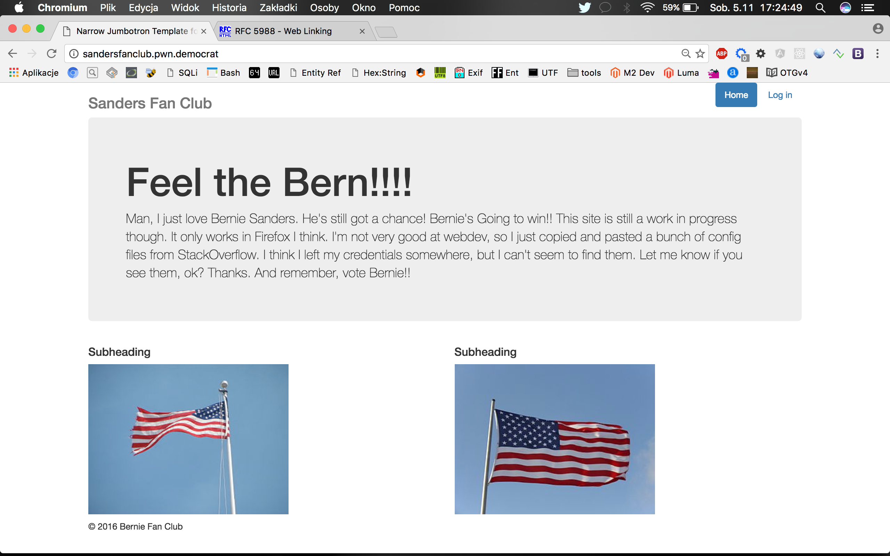
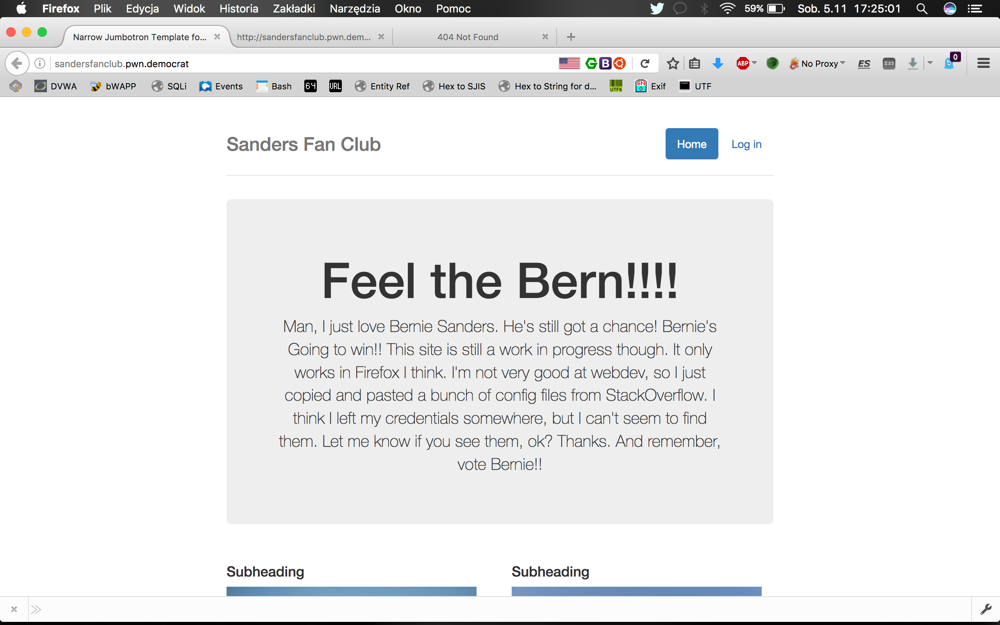
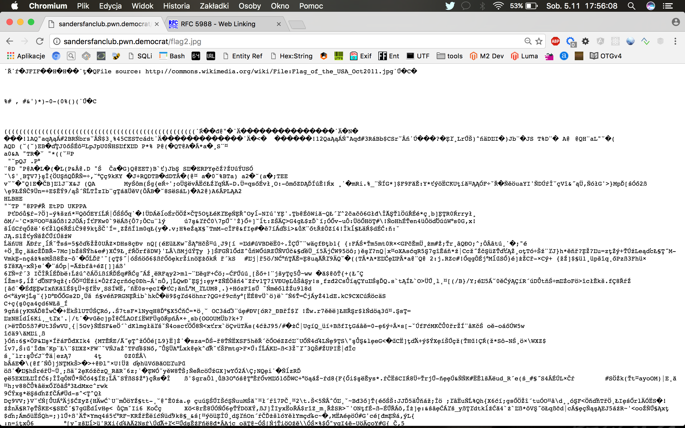
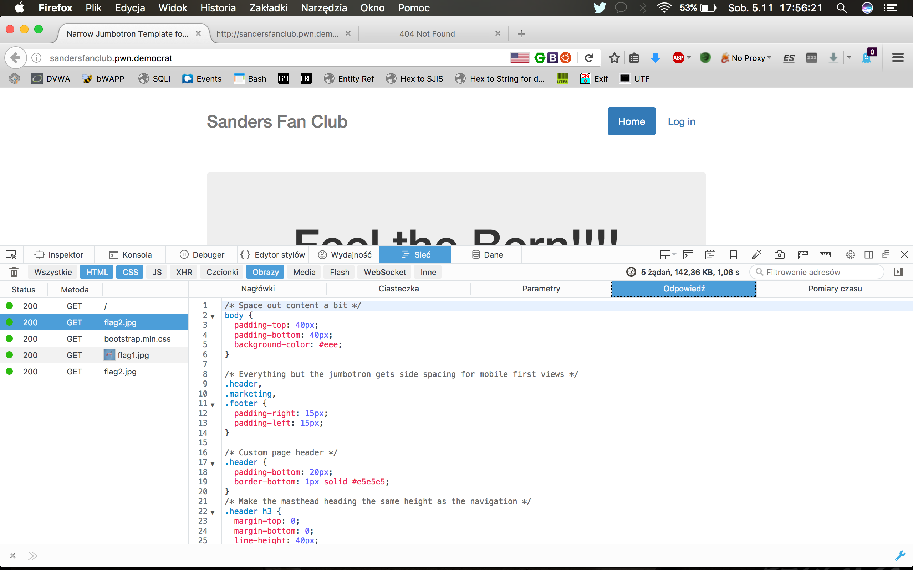
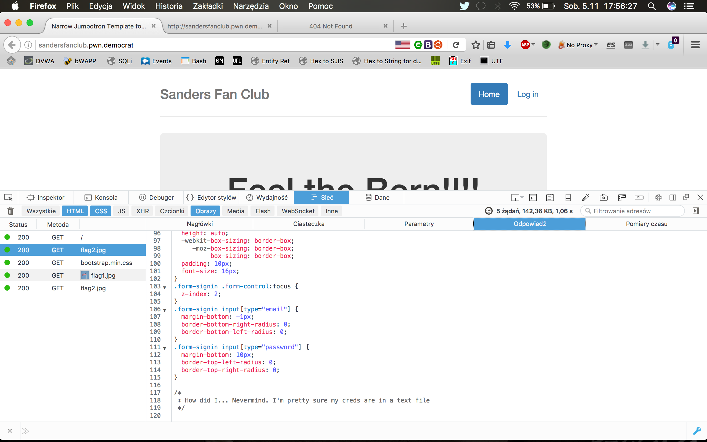
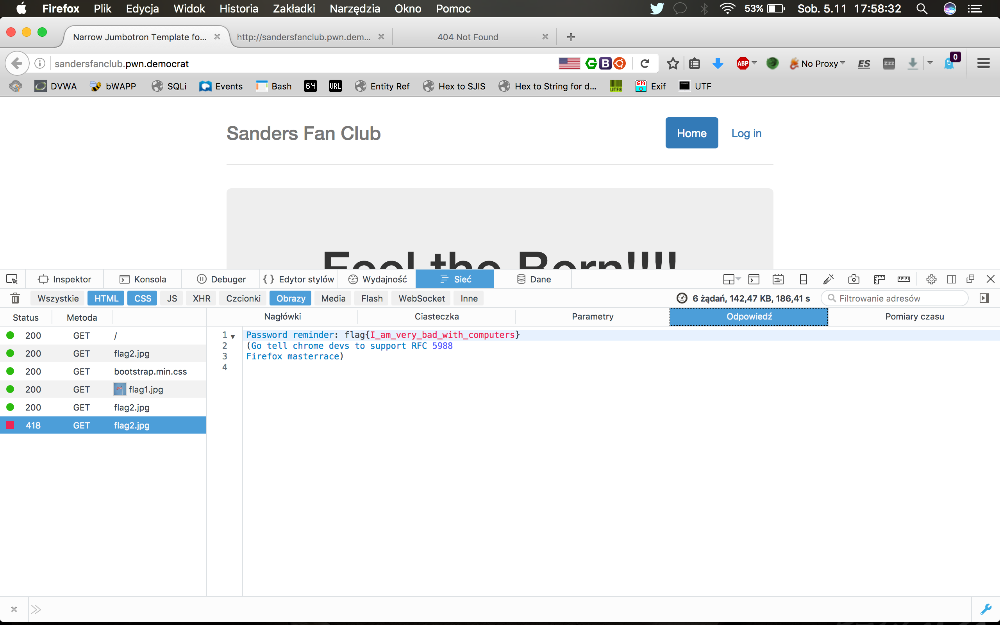

# Sanders Fan Club (Web, 100pts)

## Problem

Those deplorable Sanders supporters are still fighting. Shut the site down by finding where the idiot stored his credentials.

http://sandersfanclub.pwn.democrat

author's irc nick: Lense

## Solution

Sanders Fan Club is a simple website. We get information that site is still work in progress, webmaster left his credentials to admin account somewhere and very important one - site is work well only in Firefox browser.

Indeed, when I compared site in Firefox and Chrome, it looks quite different, like in Chrome not all CSS rules were applied:






The problem was file **flag2.jpg** which contains not only legitimate JPEG file, but also some binary data, which I was trying to identify first as some hidden information or encrypted flag:




But as it was _Web_ category, I get back and focus on anything which was obviously web oriented. It was very surprising for me when I found CSS rule for one of DIV elements and this rule comes from flag2.jpg file. It was clear for me I didn't know everything about how CSS could be passed to the browser. 

The answer was RFC 5988.

### RFC 5988 FTW!

RFC 5988 defines Web Linking standard (https://tools.ietf.org/html/rfc5988).

Web Linking standard offers _Link_ HTTP header, which contains filename and content type for this file name. In this particular challenge, this is how server responses for browser request for __flag2.jpg__ file:

```
Accept-Ranges:bytes
Connection:close
Content-Length:11187
Content-Type:text/css
Date:Sat, 05 Nov 2016 23:00:22 GMT
ETag:"581a7f27-2bb3"
Last-Modified:Thu, 03 Nov 2016 00:04:55 GMT
Link:<flag2.jpg>;rel=stylesheet
Server:nginx/1.10.0 (Ubuntu)
```

Firefox handles __Link__ header as described in RFC 5988, so in developer tools I could see text content of this file, which was legitimate CSS file:



When I've scrolled the file to the bottom, there was some comment there:




Using Burp HTTP proxy I've intercepted this response and modified the fragment of HTTP headers (I've changed Content-Type into text/plain as comment suggested):

```
Accept-Ranges:bytes
Connection:close
Content-Length:11187
Content-Type:text/plain
Date:Sat, 05 Nov 2016 23:00:22 GMT
ETag:"581a7f27-2bb3"
Last-Modified:Thu, 03 Nov 2016 00:04:55 GMT
Link:<flag2.jpg>;rel=stylesheet
Server:nginx/1.10.0 (Ubuntu)
```

The result was quite obvious - the final solution:





The flag: 

