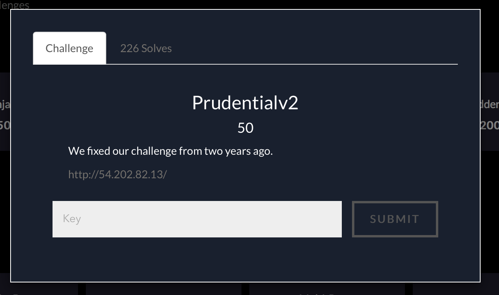
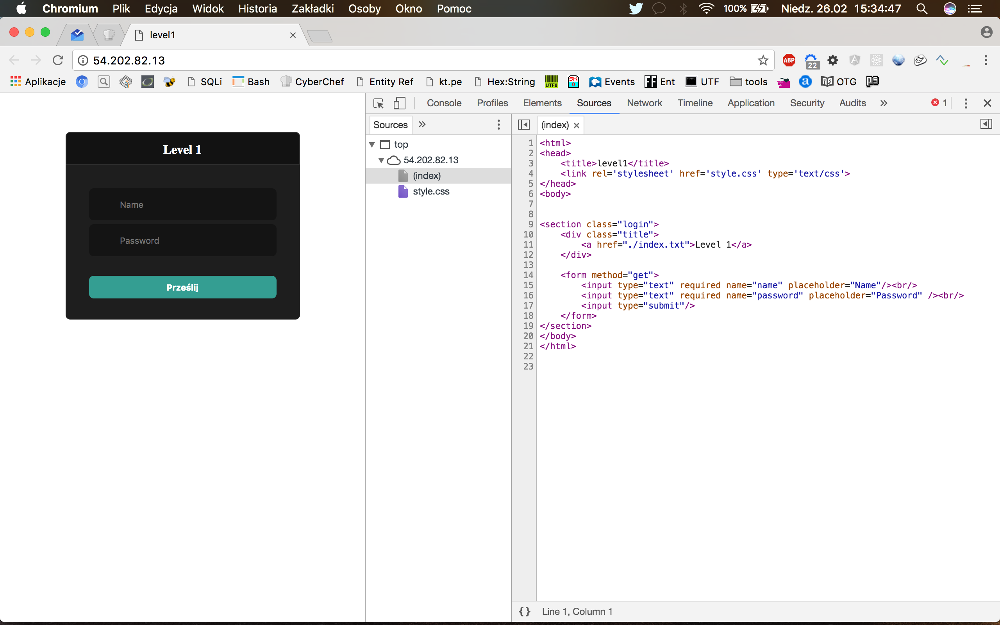
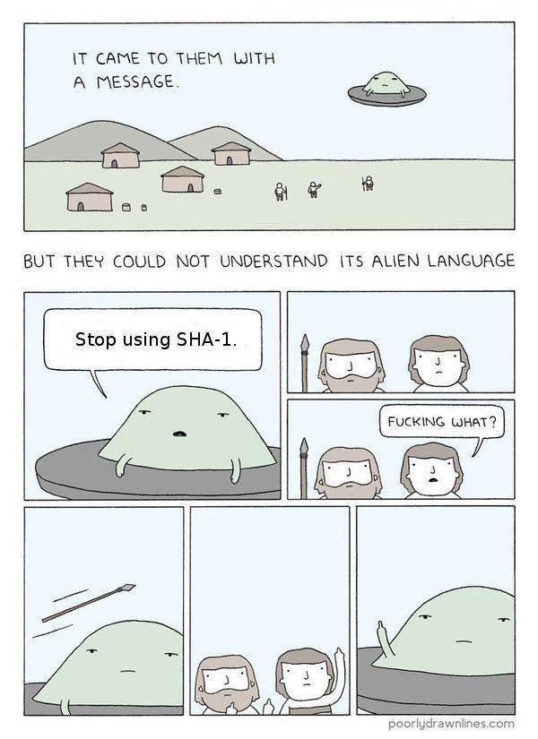

# Prudentialv2, Cloud, 50pts

## Problem



## Solution

Website contains simple HTML form with two standard fields for username and password. ```index.txt``` (see prudentialv2.txt in this repo) provides source code of both server PHP and client HTML part.





It was kinda 'déjà vu' for me. As description mentioned __Prudential__ challenge from two years earlier, I immediately went to my CTF writeups repository and found this one (Boston Key Party 2015):

https://github.com/bl4de/ctf/blob/master/2015/BostonKeyPartyCTF_2015/Prudential.md

Quick retrospective: in 2015, we have to break two __sha1()__ hashes equality checking, and it was quite easy:

```php
if (isset($_GET['name']) and isset($_GET['password'])) {
    if ($_GET['name'] == $_GET['password'])
        print 'Your password can not be your name.';
    else if (sha1($_GET['name']) === sha1($_GET['password']))
      die('Flag: '.$flag);
    else
        print '<p class="alert">Invalid password.</p>';
}
```
Solution was simple: wrong type of argument passed to __sha1()__ causes condition to fail and we get the flag:

```
http://52.10.107.64:8001/?name[]=a&password[]=b

Warning: sha1() expects parameter 1 to be string, array given in (...)ctf/BKPCTF2015/test.php on line 14

Warning: sha1() expects parameter 1 to be string, array given in (...)ctf/BKPCTF2015/test.php on line 14

Flag: [here goes the flag]

```


This year however, __things were complicated a bit__:

```php

if (isset($_GET['name']) and isset($_GET['password'])) {
    $name = (string)$_GET['name'];
    $password = (string)$_GET['password'];

    if ($name == $password) {
        print 'Your password can not be your name.';
    } else if (sha1($name) === sha1($password)) {
      die('Flag: '.$flag);
    } else {
        print '<p class="alert">Invalid password.</p>';
    }
}
```

Did you spot the difference?

Both arguments passed via ```$_GET``` are now cast to ```string``` type and trick with arrays did not work anymore (an array cast to string in PHP becomes a string ```Array``` itself, so both values from 2015 solution were equal this time and 'Your password can not be your name' appears on the screen)


SHA1 collision revealed by Google on Thursday, 23rd of February 2017 seems to be correct solution. Something what could make this:

```
sha1($name) === sha1($password)
```

to return __true__.




## SHA1 collision in practice

There are two files in this repository: sha1\_1.html and sha1\_2.html.
They both contain PDF files.

Here's the first one:

```html
%PDF-1.3
%����


1 0 obj
<</Width 2 0 R/Height 3 0 R/Type 4 0 R/Subtype 5 0 R/Filter 6 0 R/ColorSpace 7 0 R/Length 8 0 R/BitsPerComponent 8>>
stream
����$SHA-1 is dead!!!!!�/�	#9u�9���<L����Fܓ��~;���V
                                                         E�gֈ��K�Ly�+=��m�i	�kE�S
�߷`8�rr/�r�I�F�0W�����.�+�5B��-���*3.��5�M�,��t�
                                                 x0Z!Vda0��`kп?�ͨF)�<html>
<script language=javascript type="text/javascript">
<!-- @arw -->

var h = document.getElementsByTagName("HTML")[0].innerHTML.charCodeAt(102).toString(16);
if (h == '73') {
    document.body.innerHTML = "<STYLE>body{background-color:RED;} h1{font-size:500%;}</STYLE><H1>&#x1f648;</H1>";
} else {
    document.body.innerHTML = "<STYLE>body{background-color:BLUE;} h1{font-size:500%;}</STYLE><H1>&#x1f649;</H1>";
}

</script>
```

and here's the second one:

```html
%PDF-1.3
%����


1 0 obj
<</Width 2 0 R/Height 3 0 R/Type 4 0 R/Subtype 5 0 R/Filter 6 0 R/ColorSpace 7 0 R/Length 8 0 R/BitsPerComponent 8>>
stream
����$SHA-1 is dead!!!!!�/�	#9u�9���<L����sFܑf�~���!�V��g̨��[�Ly
���dy                                                             +=��m��	��E�O&�߳�8�j�/�r�E��F�<W���U.�+�1���7���3.ߓ�5�M�
     x,v!V`�0���kЯ?�ͤ�F)�<html>
<script language=javascript type="text/javascript">
<!-- @arw -->

var h = document.getElementsByTagName("HTML")[0].innerHTML.charCodeAt(102).toString(16);
if (h == '73') {
    document.body.innerHTML = "<STYLE>body{background-color:RED;} h1{font-size:500%;}</STYLE><H1>&#x1f648;</H1>";
} else {
    document.body.innerHTML = "<STYLE>body{background-color:BLUE;} h1{font-size:500%;}</STYLE><H1>&#x1f649;</H1>";
}

</script>
```

If you'll compare them, they differ. If you'll try to open them in the browser, you'll see two different images.

But when you'll calculate their SHA1 checksums, you'll be surprised:

```
bl4de:~/hacking/ctf/2017/BostonKeyParty_2017/Prudentialv2 $ shasum sha1_1.html
ba97502d759d58f91ed212d7c981e0cfdfb70eef  sha1_1.html
bl4de:~/hacking/ctf/2017/BostonKeyParty_2017/Prudentialv2 $ shasum sha1_2.html
ba97502d759d58f91ed212d7c981e0cfdfb70eef  sha1_2.html
bl4de:~/hacking/ctf/2017/BostonKeyParty_2017/Prudentialv2 $
```

All I had to do was to create exploit, which used the content of first file as value for ```name``` and second one as ```password```.


```Python
#!/usr/bin/env python
import requests

# this is copy/paste from Hex editor - two different files with the same SHA1 checksum
name = '255044462D312E33 0A25E2E3 CFD30A0A 0A312030 206F626A 0A3C3C2F 57696474 68203220 3020522F 48656967 68742033 20302052 2F547970 65203420 3020522F 53756274 79706520 35203020 522F4669 6C746572 20362030 20522F43 6F6C6F72 53706163 65203720 3020522F 4C656E67 74682038 20302052 2F426974 73506572 436F6D70 6F6E656E 7420383E 3E0A7374 7265616D 0AFFD8FF FE002453 48412D31 20697320 64656164 21212121 21852FEC 09233975 9C39B1A1 C63C4C97 E1FFFE01 7F46DC93 A6B67E01 3B029AAA 1DB2560B 45CA67D6 88C7F84B 8C4C791F E02B3DF6 14F86DB1 690901C5 6B45C153 0AFEDFB7 6038E972 722FE7AD 728F0E49 04E046C2 30570FE9 D41398AB E12EF5BC 942BE335 42A4802D 98B5D70F 2A332EC3 7FAC3514 E74DDC0F 2CC1A874 CD0C7830 5A215664 61309789 606BD0BF 3F98CDA8 044629A1 3C68746D 6C3E0A3C 73637269 7074206C 616E6775 6167653D 6A617661 73637269 70742074 7970653D 22746578 742F6A61 76617363 72697074 223E0A3C 212D2D20 40617277 202D2D3E 0A0A7661 72206820 3D20646F 63756D65 6E742E67 6574456C 656D656E 74734279 5461674E 616D6528 2248544D 4C22295B 305D2E69 6E6E6572 48544D4C 2E636861 72436F64 65417428 31303229 2E746F53 7472696E 67283136 293B0A69 66202868 203D3D20 27373327 29207B0A 20202020 646F6375 6D656E74 2E626F64 792E696E 6E657248 544D4C20 3D20223C 5354594C 453E626F 64797B62 61636B67 726F756E 642D636F 6C6F723A 5245443B 7D206831 7B666F6E 742D7369 7A653A35 3030253B 7D3C2F53 54594C45 3E3C4831 3E262378 31663634 383B3C2F 48313E22 3B0A7D20 656C7365 207B0A20 20202064 6F63756D 656E742E 626F6479 2E696E6E 65724854 4D4C203D 20223C53 54594C45 3E626F64 797B6261 636B6772 6F756E64 2D636F6C 6F723A42 4C55453B 7D206831 7B666F6E 742D7369 7A653A35 3030253B 7D3C2F53 54594C45 3E3C4831 3E262378 31663634 393B3C2F 48313E22 3B0A7D0A 0A3C2F73 63726970 743E0A0A'

password = '25504446 2D312E33 0A25E2E3 CFD30A0A 0A312030 206F626A 0A3C3C2F 57696474 68203220 3020522F 48656967 68742033 20302052 2F547970 65203420 3020522F 53756274 79706520 35203020 522F4669 6C746572 20362030 20522F43 6F6C6F72 53706163 65203720 3020522F 4C656E67 74682038 20302052 2F426974 73506572 436F6D70 6F6E656E 7420383E 3E0A7374 7265616D 0AFFD8FF FE002453 48412D31 20697320 64656164 21212121 21852FEC 09233975 9C39B1A1 C63C4C97 E1FFFE01 7346DC91 66B67E11 8F029AB6 21B2560F F9CA67CC A8C7F85B A84C7903 0C2B3DE2 18F86DB3 A90901D5 DF45C14F 26FEDFB3 DC38E96A C22FE7BD 728F0E45 BCE046D2 3C570FEB 141398BB 552EF5A0 A82BE331 FEA48037 B8B5D71F 0E332EDF 93AC3500 EB4DDC0D ECC1A864 790C782C 76215660 DD309791 D06BD0AF 3F98CDA4 BC4629B1 3C68746D 6C3E0A3C 73637269 7074206C 616E6775 6167653D 6A617661 73637269 70742074 7970653D 22746578 742F6A61 76617363 72697074 223E0A3C 212D2D20 40617277 202D2D3E 0A0A7661 72206820 3D20646F 63756D65 6E742E67 6574456C 656D656E 74734279 5461674E 616D6528 2248544D 4C22295B 305D2E69 6E6E6572 48544D4C 2E636861 72436F64 65417428 31303229 2E746F53 7472696E 67283136 293B0A69 66202868 203D3D20 27373327 29207B0A 20202020 646F6375 6D656E74 2E626F64 792E696E 6E657248 544D4C20 3D20223C 5354594C 453E626F 64797B62 61636B67 726F756E 642D636F 6C6F723A 5245443B 7D206831 7B666F6E 742D7369 7A653A35 3030253B 7D3C2F53 54594C45 3E3C4831 3E262378 31663634 383B3C2F 48313E22 3B0A7D20 656C7365 207B0A20 20202064 6F63756D 656E742E 626F6479 2E696E6E 65724854 4D4C203D 20223C53 54594C45 3E626F64 797B6261 636B6772 6F756E64 2D636F6C 6F723A42 4C55453B 7D206831 7B666F6E 742D7369 7A653A35 3030253B 7D3C2F53 54594C45 3E3C4831 3E262378 31663634 393B3C2F 48313E22 3B0A7D0A 0A3C2F73 63726970 743E0A0A'

print '[+] create URL decoded strings to send as GET parameters [name] and [password]...'
name = ''.join(name.split(' '))
password = ''.join(password.split(' '))

namestr = ''.join(['%' + name[i] + name[i + 1]
           for i in range(0, len(name)) if i % 2 == 0])

passwordstr = ''.join(['%' + password[j] + password[j + 1]
           for j in range(0, len(password)) if j % 2 == 0])

print '[+] sending request to http://54.202.82.13/?name=[name]&password=[password]'

u = 'http://54.202.82.13/?name={}&password={}'.format(namestr, passwordstr)

resp = requests.get(u, headers={
    'Host': '54.202.82.13'
})

print '[+] read FLAG from response...\n\n'
print resp.content

```

I've run it and it worked like a charm:


```
bl4de:~/hacking/ctf/2017/BostonKeyParty_2017/Prudentialv2 $ ./prudential.py
[+] create URL decoded strings to send as GET parameters [name] and [password]...
[+] sending request to http://54.202.82.13/?name=[name]&password=[password]
[+] read FLAG from response...


<html>
<head>
	<title>level1</title>
    <link rel='stylesheet' href='style.css' type='text/css'>
</head>
<body>

Flag: FLAG{AfterThursdayWeHadToReduceThePointValue}
bl4de:~/hacking/ctf/2017/BostonKeyParty_2017/Prudentialv2 $
```


__FLAG{AfterThursdayWeHadToReduceThePointValue}__


## Links

#### SHA1 collision by Google:

https://security.googleblog.com/2017/02/announcing-first-sha1-collision.html					
https://shattered.io					
