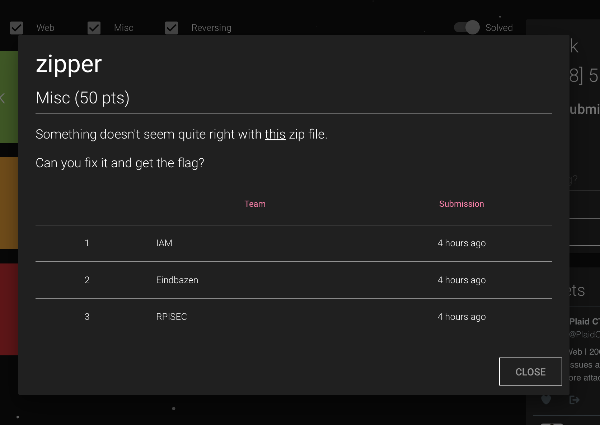
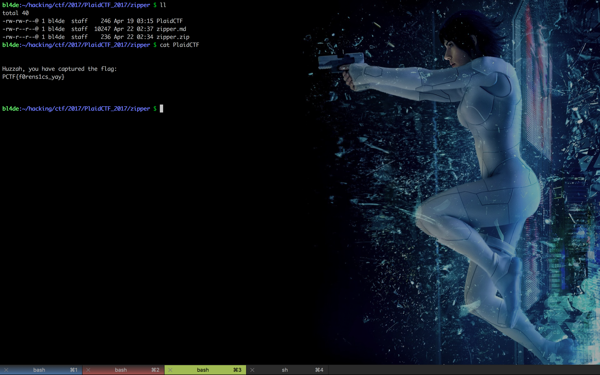

# Zipper, Misc, 50pts

## Problem

Something doesn't seem quite right with this zip [zipper.zip] file. 
Can you fix it and get the flag?





## Solution

```zipper.zip``` contains zip archive, but there's one problem: archive is corrupted and there is no way to unzip it:

```
bl4de:~/hacking/ctf/2017/PlaidCTF_2017/zipper $ zipinfo zipper.zip
Archive:  zipper.zip
Zip file size: 236 bytes, number of entries: 1
warning:  filename too long--truncating.
[  ]
-rw-rw-r--  3.0 unx      246 tx defX 17-Apr-18 19:15
```

More detailed view shows the problem - filename has wrong size and no ```CENTRAL HEADER``` is present:

```
bl4de:~/hacking/ctf/2017/PlaidCTF_2017/zipper $ zipdetails -v zipper.zip

0000 0004 50 4B 03 04 LOCAL HEADER #1       04034B50
0004 0001 14          Extract Zip Spec      14 '2.0'
0005 0001 00          Extract OS            00 'MS-DOS'
0006 0002 02 00       General Purpose Flag  0002
                      [Bits 1-2]            2 'Fast Compression'
0008 0002 08 00       Compression Method    0008 'Deflated'
000A 0004 FC 99 92 4A Last Mod Time         4A9299FC 'Tue Apr 18 19:15:56 2017'
000E 0004 3E A9 2E 53 CRC                   532EA93E
0012 0004 46 00 00 00 Compressed Length     00000046
0016 0004 F6 00 00 00 Uncompressed Length   000000F6
001A 0002 29 23       Filename Length       2329
001C 0002 1C 00       Extra Length          001C
Truncated file (got 206, wanted 9001):
```

If we try to unzip archive, we get an error:

```
bl4de:~/hacking/ctf/2017/PlaidCTF_2017/zipper $ unzip zipper.zip
Archive:  zipper.zip
warning:  filename too long--truncating.
[  ]
:  bad extra field length (central)
```

There's definitely problem with filename:

```
001A 0002 29 23       Filename Length       2329
```

Filename length (in bytes) shows that it should be 9001 bytes length, which is insane.
Let's try to cut this off into reasonable 8 bytes:

```
001A 0002 08 00       Filename Length       0008
```

Now, it's getting much better:


```
bl4de:~/hacking/ctf/2017/PlaidCTF_2017/zipper $ zipdetails -v zipper.zip

0000 0004 50 4B 03 04 LOCAL HEADER #1       04034B50
0004 0001 14          Extract Zip Spec      14 '2.0'
0005 0001 00          Extract OS            00 'MS-DOS'
0006 0002 02 00       General Purpose Flag  0002
                      [Bits 1-2]            2 'Fast Compression'
0008 0002 08 00       Compression Method    0008 'Deflated'
000A 0004 FC 99 92 4A Last Mod Time         4A9299FC 'Tue Apr 18 19:15:56 2017'
000E 0004 3E A9 2E 53 CRC                   532EA93E
0012 0004 46 00 00 00 Compressed Length     00000046
0016 0004 F6 00 00 00 Uncompressed Length   000000F6
001A 0002 08 00       Filename Length       0008
001C 0002 1C 00       Extra Length          001C
001E 0008 00 00 00 00 Filename              '        '
          00 00 00 00
0026 0002 55 54       Extra ID #0001        5455 'UT: Extended Timestamp'
0028 0002 09 00         Length              0009
002A 0001 03            Flags               '03 mod access'
002B 0004 5B C8 F6 58   Mod Time            58F6C85B 'Wed Apr 19 03:15:55 2017'
002F 0004 5B C8 F6 58   Access Time         58F6C85B 'Wed Apr 19 03:15:55 2017'
0033 0002 75 78       Extra ID #0002        7875 'ux: Unix Extra Type 3'
0035 0002 0B 00         Length              000B
0037 0001 01            Version             01
0038 0001 04            UID Size            04
0039 0004 E8 03 00 00   UID                 000003E8
003D 0001 04            GID Size            04
003E 0004 E8 03 00 00   GID                 000003E8
0042 0046 53 50 20 04 PAYLOAD               SP ....+.(..J..Q../U.H,KUHN,()-
          B8 14 08 2B                       JMQ(.HUH.IL...p.q.N3(J.+6L...L..%.&.(
          F1 28 AD AA                       ..
          4A CC D0 51
          A8 CC 2F 55
          C8 48 2C 4B
          55 48 4E 2C
          28 29 2D 4A
          4D 51 28 C9
          48 55 48 CB
          49 4C B7 E2
          0A 70 0E 71
          AB 4E 33 28
          4A CD 2B 36
          4C 2E 8E AF
          4C AC AC 25
          C3 26 EA 28
          01 00

0088 0004 50 4B 01 02 CENTRAL HEADER #1     02014B50
008C 0001 1E          Created Zip Spec      1E '3.0'
008D 0001 03          Created OS            03 'Unix'
008E 0001 14          Extract Zip Spec      14 '2.0'
008F 0001 00          Extract OS            00 'MS-DOS'
0090 0002 02 00       General Purpose Flag  0002
                      [Bits 1-2]            2 'Fast Compression'
0092 0002 08 00       Compression Method    0008 'Deflated'
0094 0004 FC 99 92 4A Last Mod Time         4A9299FC 'Tue Apr 18 19:15:56 2017'
0098 0004 3E A9 2E 53 CRC                   532EA93E
009C 0004 46 00 00 00 Compressed Length     00000046
00A0 0004 F6 00 00 00 Uncompressed Length   000000F6
00A4 0002 29 23       Filename Length       2329
00A6 0002 18 00       Extra Length          0018
00A8 0002 00 00       Comment Length        0000
00AA 0002 00 00       Disk Start            0000
00AC 0002 01 00       Int File Attributes   0001
                      [Bit 0]               1 Text Data
00AE 0004 00 00 B4 81 Ext File Attributes   81B40000
00B2 0004 00 00 00 00 Local Header Offset   00000000
Truncated file (got 54, wanted 9001):
```

We get ```CENTRAL HEADER``` back, now we have to fix its ```Filename Length``` field as well.
As we can see, the filename itself is blank, so we fill it using ```PlaidCTF``` string, which is exactly 8 bytes length. How nice :)

```
bl4de:~/hacking/ctf/2017/PlaidCTF_2017/zipper $ zipdetails -v zipper.zip

0000 0004 50 4B 03 04 LOCAL HEADER #1       04034B50
0004 0001 14          Extract Zip Spec      14 '2.0'
0005 0001 00          Extract OS            00 'MS-DOS'
0006 0002 02 00       General Purpose Flag  0002
                      [Bits 1-2]            2 'Fast Compression'
0008 0002 08 00       Compression Method    0008 'Deflated'
000A 0004 FC 99 92 4A Last Mod Time         4A9299FC 'Tue Apr 18 19:15:56 2017'
000E 0004 3E A9 2E 53 CRC                   532EA93E
0012 0004 46 00 00 00 Compressed Length     00000046
0016 0004 F6 00 00 00 Uncompressed Length   000000F6
001A 0002 08 00       Filename Length       0008
001C 0002 1C 00       Extra Length          001C
001E 0008 50 6C 61 69 Filename              'PlaidCTF'
          64 43 54 46
0026 0002 55 54       Extra ID #0001        5455 'UT: Extended Timestamp'
0028 0002 09 00         Length              0009
002A 0001 03            Flags               '03 mod access'
002B 0004 5B C8 F6 58   Mod Time            58F6C85B 'Wed Apr 19 03:15:55 2017'
002F 0004 5B C8 F6 58   Access Time         58F6C85B 'Wed Apr 19 03:15:55 2017'
0033 0002 75 78       Extra ID #0002        7875 'ux: Unix Extra Type 3'
0035 0002 0B 00         Length              000B
0037 0001 01            Version             01
0038 0001 04            UID Size            04
0039 0004 E8 03 00 00   UID                 000003E8
003D 0001 04            GID Size            04
003E 0004 E8 03 00 00   GID                 000003E8
0042 0046 53 50 20 04 PAYLOAD               SP ....+.(..J..Q../U.H,KUHN,()-
          B8 14 08 2B                       JMQ(.HUH.IL...p.q.N3(J.+6L...L..%.&.(
          F1 28 AD AA                       ..
          4A CC D0 51
          A8 CC 2F 55
          C8 48 2C 4B
          55 48 4E 2C
          28 29 2D 4A
          4D 51 28 C9
          48 55 48 CB
          49 4C B7 E2
          0A 70 0E 71
          AB 4E 33 28
          4A CD 2B 36
          4C 2E 8E AF
          4C AC AC 25
          C3 26 EA 28
          01 00

0088 0004 50 4B 01 02 CENTRAL HEADER #1     02014B50
008C 0001 1E          Created Zip Spec      1E '3.0'
008D 0001 03          Created OS            03 'Unix'
008E 0001 14          Extract Zip Spec      14 '2.0'
008F 0001 00          Extract OS            00 'MS-DOS'
0090 0002 02 00       General Purpose Flag  0002
                      [Bits 1-2]            2 'Fast Compression'
0092 0002 08 00       Compression Method    0008 'Deflated'
0094 0004 FC 99 92 4A Last Mod Time         4A9299FC 'Tue Apr 18 19:15:56 2017'
0098 0004 3E A9 2E 53 CRC                   532EA93E
009C 0004 46 00 00 00 Compressed Length     00000046
00A0 0004 F6 00 00 00 Uncompressed Length   000000F6
00A4 0002 08 00       Filename Length       0008
00A6 0002 18 00       Extra Length          0018
00A8 0002 00 00       Comment Length        0000
00AA 0002 00 00       Disk Start            0000
00AC 0002 01 00       Int File Attributes   0001
                      [Bit 0]               1 Text Data
00AE 0004 00 00 B4 81 Ext File Attributes   81B40000
00B2 0004 00 00 00 00 Local Header Offset   00000000
00B6 0008 50 6C 61 69 Filename              'PlaidCTF'
          64 43 54 46
00BE 0002 55 54       Extra ID #0001        5455 'UT: Extended Timestamp'
00C0 0002 05 00         Length              0005
00C2 0001 03            Flags               '03 mod access'
00C3 0004 5B C8 F6 58   Mod Time            58F6C85B 'Wed Apr 19 03:15:55 2017'
00C7 0002 75 78       Extra ID #0002        7875 'ux: Unix Extra Type 3'
00C9 0002 0B 00         Length              000B
00CB 0001 01            Version             01
00CC 0001 04            UID Size            04
00CD 0004 E8 03 00 00   UID                 000003E8
00D1 0001 04            GID Size            04
00D2 0004 E8 03 00 00   GID                 000003E8

00D6 0004 50 4B 05 06 END CENTRAL HEADER    06054B50
00DA 0002 00 00       Number of this disk   0000
00DC 0002 00 00       Central Dir Disk no   0000
00DE 0002 01 00       Entries in this disk  0001
00E0 0002 01 00       Total Entries         0001
00E2 0004 4E 00 00 00 Size of Central Dir   0000004E
00E6 0004 88 00 00 00 Offset to Central Dir 00000088
00EA 0002 00 00       Comment Length        0000
Done
```

Now, let's try to verify if everything is fine:

```
bl4de:~/hacking/ctf/2017/PlaidCTF_2017/zipper $ zipinfo zipper.zip
Archive:  zipper.zip
Zip file size: 236 bytes, number of entries: 1
-rw-rw-r--  3.0 unx      246 tx defX 17-Apr-19 03:15 PlaidCTF
1 file, 246 bytes uncompressed, 70 bytes compressed:  71.5%
```

Looks good, let's unzip it:

```
bl4de:~/hacking/ctf/2017/PlaidCTF_2017/zipper $ unzip zipper.zip
Archive:  zipper.zip
  inflating: PlaidCTF
```

Good. Last thing is to see what is in ```PlaidCTF``` file:

```
bl4de:~/hacking/ctf/2017/PlaidCTF_2017/zipper $ cat PlaidCTF


Huzzah, you have captured the flag:
PCTF{f0rens1cs_yay}


```

## Resources

It wasn't very complicated, however this task was a nice way to go a little bit deeper into ```zip``` file format as well as found such nice tools like ```zipinfo``` and ```zipdetails```.


I recommend to take a look at those two resources:

Wikipedia

https://en.wikipedia.org/wiki/Zip_(file_format)

.ZIP File Format Specification, Version: 6.3.4 

https://pkware.cachefly.net/webdocs/casestudies/APPNOTE.TXT


Thanks for reading!

bl4de



