# Bloody Feedback, Web, 100pts

## Problem

Bloody Feedback

Send your feedback at bloody-feedback.quals.2017.volgactf.ru

DO. NOT. USE. SQLMAP
Otherwise your IP will be banned


## Looking around

When we enter challenge url, nice welcome screen appears


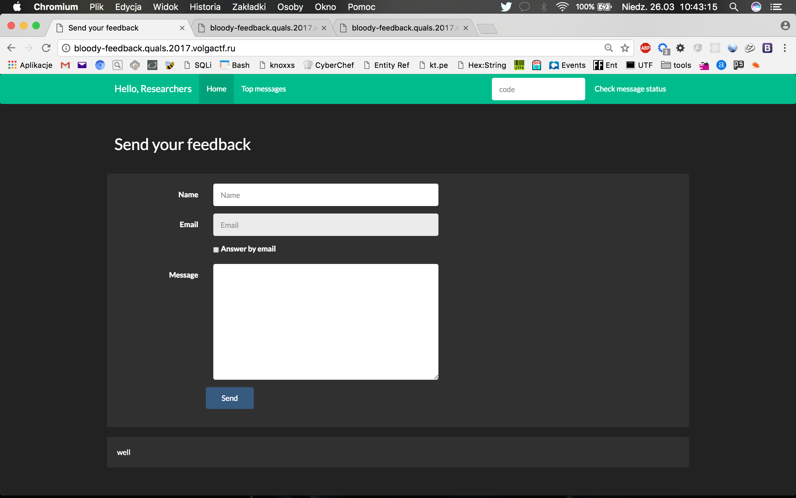

We can send a message and when we did this - we get the page with hash allowing us to check message status:

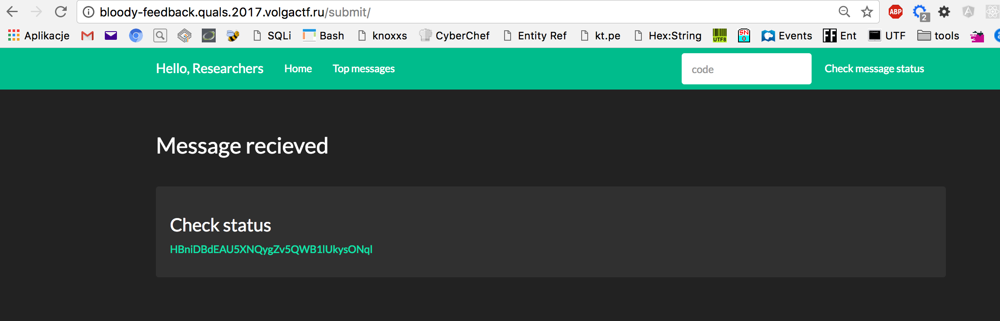

When we click the link, status of newly added message is shown:

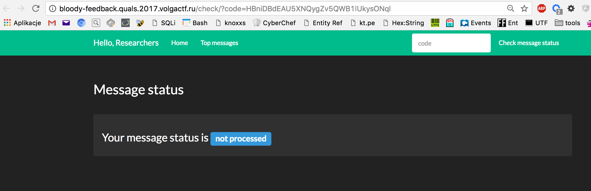

Top messages (at least the last ones) are shown when we get into 'Top messages' tab.

And that's pretty all. Time to get hands dirty.


## Solution

First, I've tried some obvious injections (', ", [] and so on) and parameters manipulation in the url where we can check the status. This quickly get my attention as error message appeared:

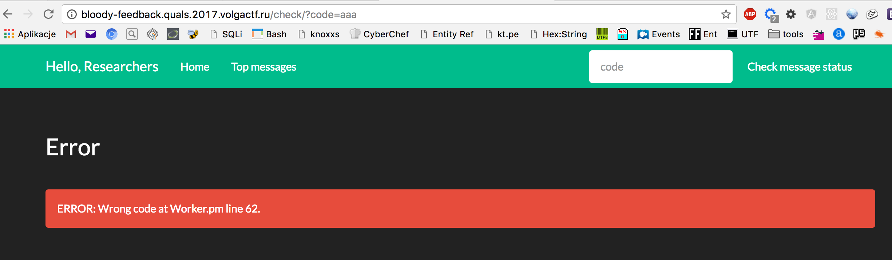

```Worker.pm``` looks like Perl script, so I've tried couple of classic Bash injections, but after some time I've realized it wasn't the right exploitation vector. So I've moved to the form.

After several tries and fails, I found ```email``` field was vulnerable for injection. I've created simple injection string (again started to exploit Bash injection):

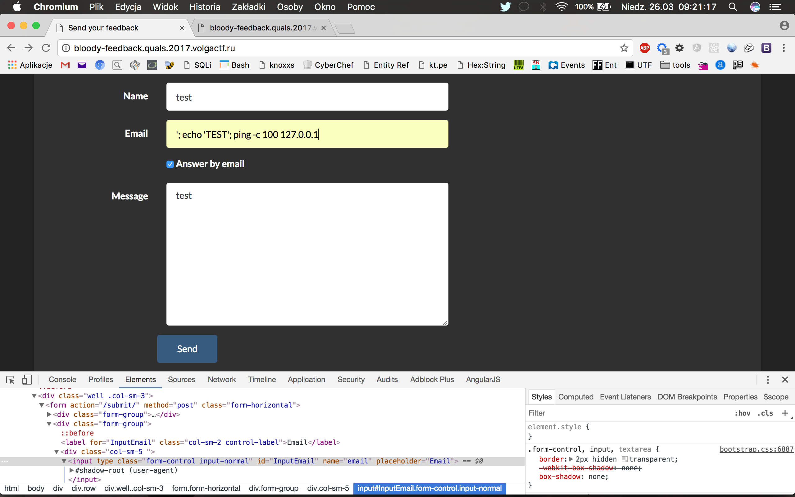

But when I saw response, I've realized that Bash injection was dead end :)

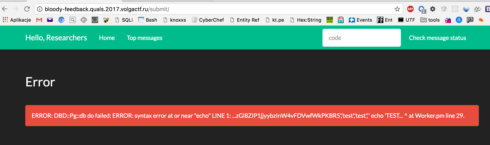


It was ```PostgreSQL``` SQL injection, with quite verbose error message, so...


Now I needed to figure out, what the flow of queries was.

First query selected email, name and message passed from the form and id and hash generated for the url to check message status. I could add UNION query, but error occurred that number of columns differs:

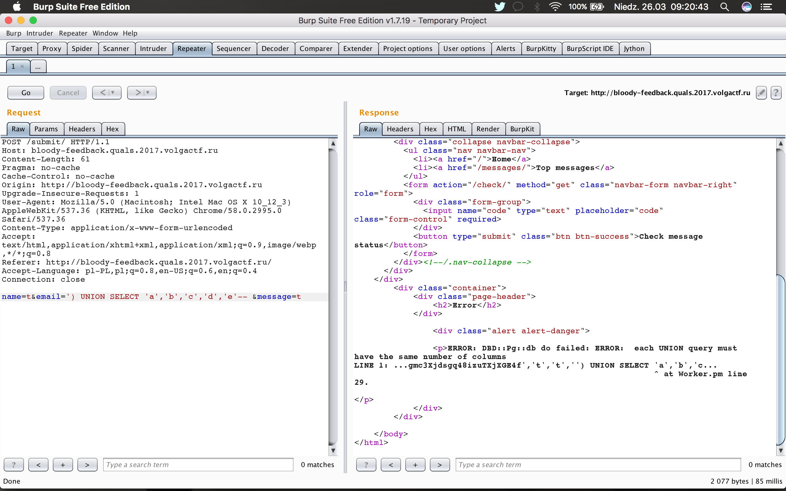

Ok, there's some empty string appeared as the last value in the first query. Trying to fill this column with something, I send following payload (I've used __user__ PostgreSQL function as the last column value, which should returns username of the current database):

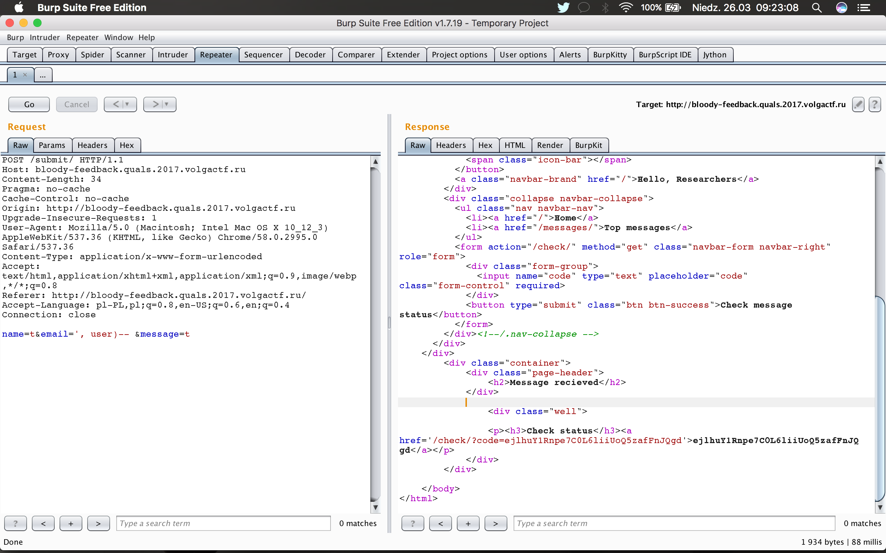

Wow, no error this time! And I get link to check status of the message. I get to this url and:

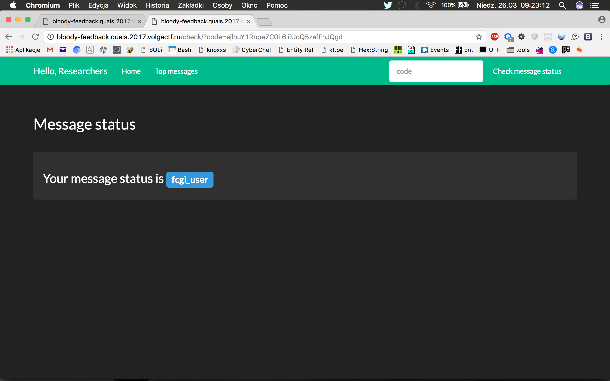

Bingo!

So the last column was the string describing message status. And it was by default ```not processed``` inserted in second query - and now I could modify its value into something useful.

With some help of awesome __pentestmonkey__ PosgreSQL SQL Injection cheat sheet (http://pentestmonkey.net/cheat-sheet/sql-injection/postgres-sql-injection-cheat-sheet) I've started to extract all pieces I needed to successfully exploit the challenge and get the flag. 

First, let's figure out the name of database (I'll be showing here only POST body, without the headers; I was using Burp Repeater to send requests):

```
name=stack&email=', current_database())-- &message=gimmieflag
```

Database name was ```feedback_db```.

Next, table name where the flag should be stored:

```
name=stack&email=', (SELECT table_schema || '.' || table_name
FROM information_schema.tables WHERE table_catalog LIKE 'feedback_db' LIMIT 1 OFFSET 1))-- &message=gimmieflag

```

I was lucky enough to get correct table name with first try, which was ```public.s3cret_tabl3```:

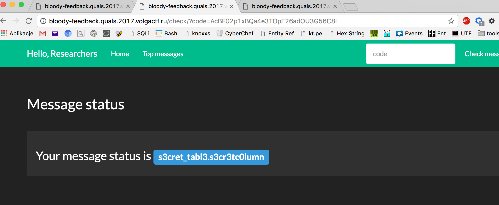

Now, time for column names:

```
name=stack&email=', (SELECT table_name || '.' || column_name 
FROM information_schema.columns WHERE table_catalog LIKE 'feedback_db' LIMIT 1 OFFSET 6))-- &message=gimmieflag
```

And the result was ```s3cret_tabl3.s3cr3tc0lumn```. I've used ```OFFSET 6``` here, because first five results were columns from table where messages where stored (I'm pretty sure there is in PostgreSQL something like ```group_concat``` in MySQL, but setting valid limit offset worked for me well).

The last phase was to get the flag from revealed table. First three results did not contain the flag, but fourth one did:

```
name=stack&email=', (SELECT s3cr3tc0lumn 
FROM s3cret_tabl3 LIMIT 1 OFFSET 4))-- &message=gimmieflag
```

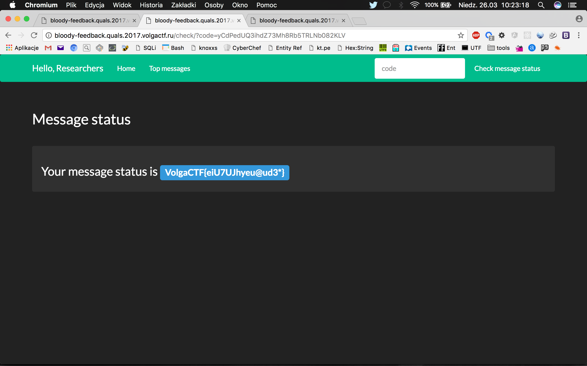


The flag: __VolgaCTF{eiU7UJhyeu@ud3*}__


 

