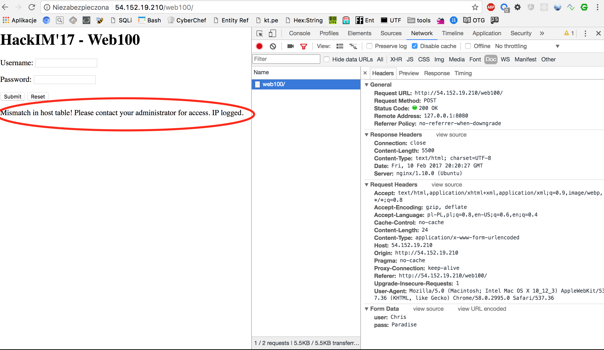
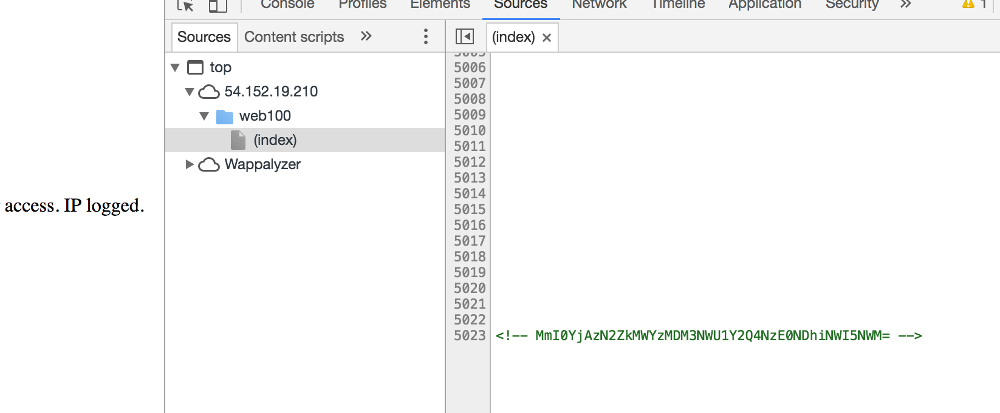
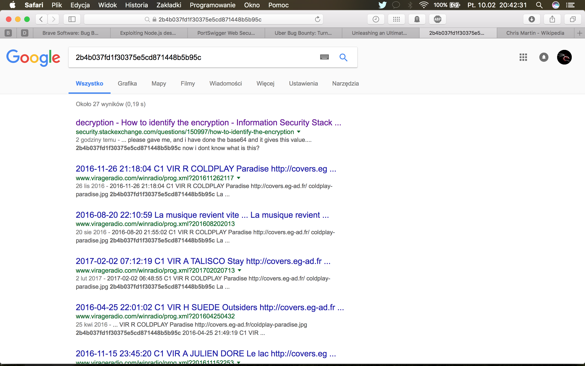
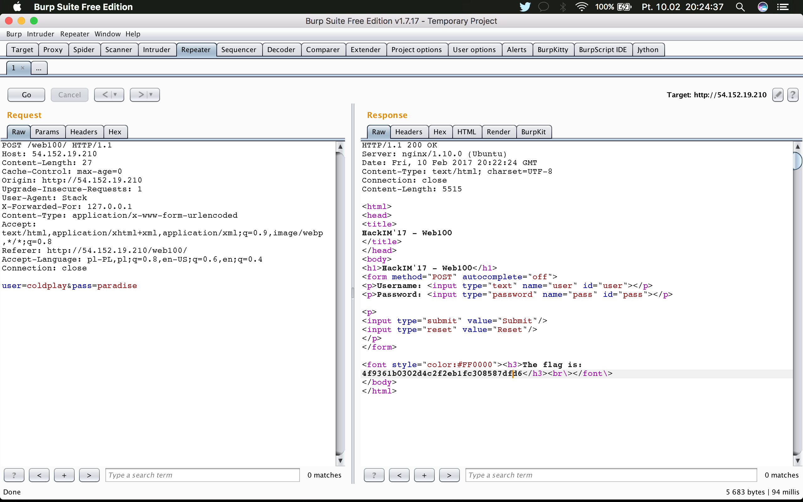

# Web1, Web, 100pts

## Problem

Chris Martin wants to go home. Can you help him get there as soon as possible?

http://54.152.19.210/web100/

## Solution

We get simple page with login form.

When I've tried to login, message about some strange error occured:


Also, in the HTML source, there was Base64 string hidden at the bottom of the page:



Time to collect all the crumbs together:

- Chris Martin (from challenge description) is co-founder and a lead of Coldplay band
- we have to help him to get home
- there is (probably) a table in database where hostname and IP are logged


First, I've tried classic SQL Injection in login form. It did not work and nothing really changed. So I decided to focus on words from error message - __host__ and __IP__.

Chris wanted to go home.

And as we know...


(source: https://images5.alphacoders.com/426/426359.png)

:)

When I've added __X-Forwarder-For__ HTTP request header with value 127.0.0.1, an error message did not appear. It was a good sign.

```
POST /web100/ HTTP/1.1
Host: 54.152.19.210
Content-Length: 27
Cache-Control: max-age=0
Origin: http://54.152.19.210
Upgrade-Insecure-Requests: 1
User-Agent: Stack
X-Forwarded-For: 127.0.0.1
Content-Type: application/x-www-form-urlencoded
Accept: text/html,application/xhtml+xml,application/xml;q=0.9,image/webp,*/*;q=0.8
Referer: http://54.152.19.210/web100/
Accept-Language: pl-PL,pl;q=0.8,en-US;q=0.6,en;q=0.4
Connection: close
```

But still username and password was left to find.

Decoded Base64 string contains MD5 hash: 2b4b037fd1f30375e5cd871448b5b95c. When I've tried to look for it in Google hoping it is already cracked password, the only thing I found was this:




All results were just links to XML with list of songs. However, those links also contained reference to 'Coldplay - Paradise' album name. It just could not be accident.

Indeed, __coldplay__ as username and __paradise__ as password allows to get the flag and send Chris home:





