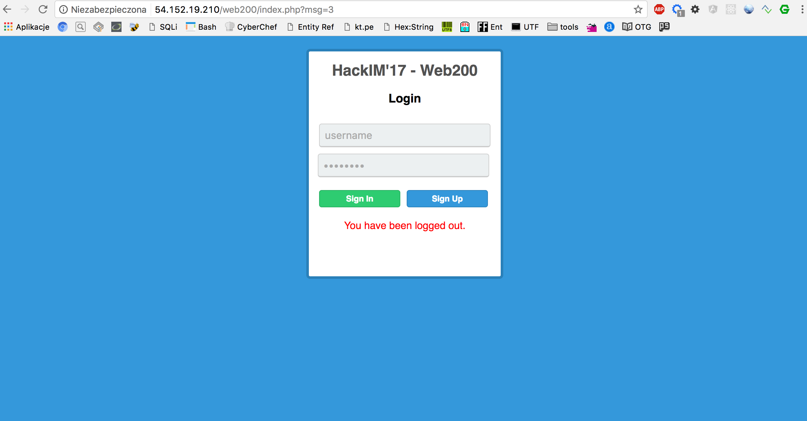

# Web2, Web, 200pts

## Problem

There are two kinds of people in this world. One with all the privileges and the others. Can you get the flag by eating some British biscuit?


http://54.152.19.210/web200/


## Solution

We get a website with register and login form.



After registering with username and password __stack:stack__ I logged in and saw the welcome screen:


![web2]
(assets/web2_2.png)

There were two cookies set (__u__ and __r__). Their values starts from the same string (351e766803). I registered two other users and found that MD5 hashes of username and __limited__ string are added and saved as __u__ and __r__ cookie respectively (those stands for, probably, user and role)

For user __stack__ with password __stack__ it was:

```
u=351e766803fac2a47adace059aff113283a03f6760  //stack
r=351e766803d63c7ede8cb1e1c8db5e51c63fd47cff  //limited
```


So the solution was simply to change those two cookies into representing __admin__ as a user and __admin__ as a role:

```
u=351e76680321232f297a57a5a743894a0e4a801fc3  //admin
r=351e76680321232f297a57a5a743894a0e4a801fc3  //admin
```
where ```351e766803``` is shared part and ```21232f297a57a5a743894a0e4a801fc3``` is MD5 hash of string  __admin__.

And it was the right solution:

![web2]
(assets/web2_3.png)

Flag: __flag{bb6df1e39bd297a47ed0eeaea9cac7ee}__


