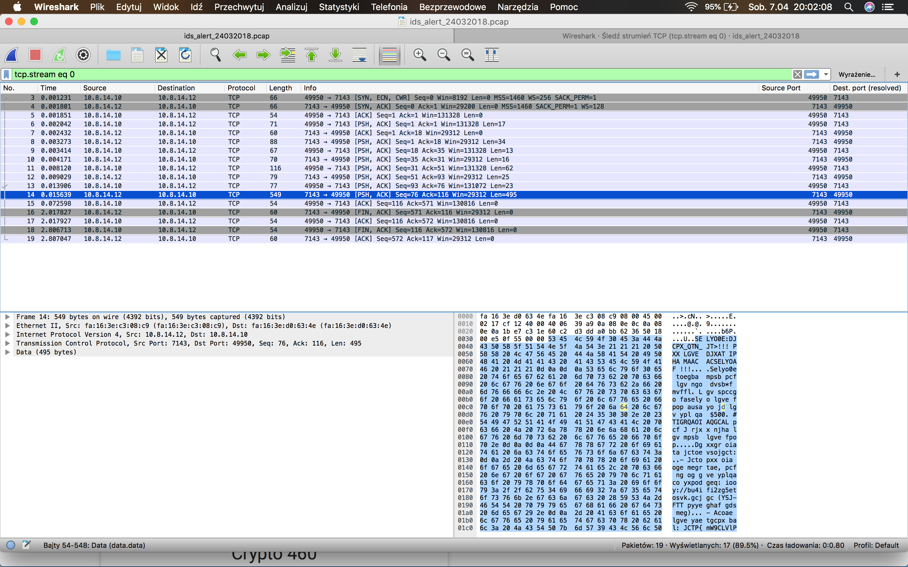
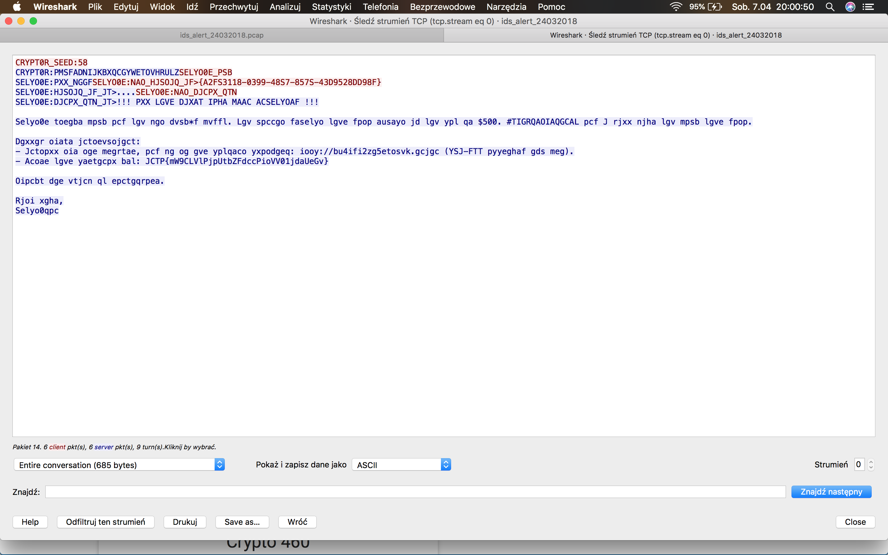

# Crypt0r part 1, Crypto, 20pts

## Problem

Our IDS detected an abnormal behavior from one of our user. We extracted this pcap, could you have a look at it?

attachement: ids_alert_24032018.pcap


## Solution

When I've downloaded an attachement (_pcap_ file) and opened it in Wireshark, it was a record of very short network transmission dump with only a few of packets:



I've spotted some kind of ciphered message and using _Follow TCP Stream_ option in Wireshark, I've extracted the content of this TCP session:



It was obvious that some kind of [substitution cipher](https://en.wikipedia.org/wiki/Substitution_cipher) was used here, as I almost immediately spotted ```JCTP{...}``` string looked exactly how the flag format for all the INS'HACK CTF challenges (only ciphered tho).

Starting from those four characters:

```
JCTP -> INSA
```

I quickly realized that ```CRYPT0R:PMSFADNIJKBXQCGYWETOVHRULZSELYO0E_PSB``` string in the ciphered message contains a key to decipher the whole message.

The only problem was to figure out the whole ciphered/plaintext relation. Based on revealed I, N, S and A and knowing their positions, I found that the beginning was actually an English alphabet:  

```
PMSFADNIJKBXQCGYWETOVHRULZSELYO0E_PSB
ABCDEFGHIJKLMNOPQRSTUVWXYZ
```

To confirm this, I've coded simple Python script to perform some basic deciphering and, when I've run it, an actual header was perfectly readable, as well as all uppercase characters in the message:
```

NWPAS0W_CRRF:58
NWPAS0W:ABCDEFGHIJKLMNOPQRSTUVWXYZCRYPT0R_ACK
CRYPT0R:ALL_GOODCRYPT0R:GET_VICTIM_ID>{E2DC3118-0399-48C7-857C-43F9528FF98D}
CRYPT0R:VICTIM_ID_IS>....CRYPT0R:GET_FINAL_MSG
CRYPT0R:FINAL_MSG_IS>!!! ALL YOUR FILES HAVE BEEN ENCRYPTED !!!

Celyo0e toegba mpsb pcf lgv ngo dvsb*f mvffl. Ygv spccgo faselyo lgve fpop ausayo jd lgv ypl qa $500. #SHOWMETHEMONEY pcf I rjxx njha lgv mpsb lgve fpop.

Fgxxgr oiata jctoevsojgct:
- Ictopxx oia oge megrtae, pcf ng og gve yplqaco yxpodgeq: iooy://bu4ifi2zg5etosvk.gcjgc (PCI-DSS pyyeghaf gds meg).
- Ecoae lgve yaetgcpx bal: INSA{mQ9NYUlAjpXtbZDdccAioUU01jdaXeOv}

Tipcbt dge vtjcn ql epctgqrpea.

Wjoi xgha,
Celyo0qpc
```

Knowing this, I've started to decipher lowercased words, just by guessing their meaning based on number of characters, position, expected meaning of the phrase and so on.

Using ```maketrans``` Python library, decipher such kind of ciphered message is pretty simple (I've just rerun it every time I wanted to find out if I actually guessed next substituted character correctly). After each run, next guess was much simpler due to readable parts of words revealed across the message.


And this is how the final script looks like:


```python
#!/usr/bin/python
from string import maketrans

c = "PMSFADNIJKBXQCGYWETOVHRULZioylgvjelyo0epqafhanjbctxmsudr"
p = "ABCDEFGHIJKLMNOPQRSTUVWXYZhtpfouirypt0ramedvegiknslbcxfw"

cross = maketrans(c,p)

inp = """
CRYPT0R_SEED:58
CRYPT0R:PMSFADNIJKBXQCGYWETOVHRULZSELYO0E_PSB
SELYO0E:PXX_NGGFSELYO0E:NAO_HJSOJQ_JF>{A2FS3118-0399-48S7-857S-43D9528DD98F}
SELYO0E:HJSOJQ_JF_JT>....SELYO0E:NAO_DJCPX_QTN
SELYO0E:DJCPX_QTN_JT>!!! PXX LGVE DJXAT IPHA MAAC ACSELYOAF !!!

Selyo0e toegba mpsb pcf lgv ngo dvsb*f mvffl. Lgv spccgo faselyo lgve fpop ausayo jd lgv ypl qa $500. #TIGRQAOIAQGCAL pcf J rjxx njha lgv mpsb lgve fpop.

Dgxxgr oiata jctoevsojgct:
- Jctopxx oia oge megrtae, pcf ng og gve yplqaco yxpodgeq: iooy://bu4ifi2zg5etosvk.gcjgc (YSJ-FTT pyyeghaf gds meg).
- Acoae lgve yaetgcpx bal: JCTP{mW9CLVlPjpUtbZFdccPioVV01jdaUeGv}

Oipcbt dge vtjcn ql epctgqrpea.

Rjoi xgha,
Selyo0qpc
"""
print inp.translate(cross)
```

When I've run it for the last time, the result was:


```
NWPAS0W_CRRF:58
NWPAS0W:ABCDEFGHIJKLMNOPQRSTUVWXYZCRYPT0R_ACK
CRYPT0R:ALL_GOODCRYPT0R:GET_VICTIM_ID>{E2DC3118-0399-48C7-857C-43F9528FF98D}
CRYPT0R:VICTIM_ID_IS>....CRYPT0R:GET_FINAL_MSG
CRYPT0R:FINAL_MSG_IS>!!! ALL YOUR FILES HAVE BEEN ENCRYPTED !!!

Crypt0r stroke back and you got fuck*d buddy. You cannot decrypt your data except if you pay me $500. #SHOWMETHEMONEY and I will give you back your data.

Follow these instructions:
- Install the tor browser, and go to our payment platform: http://kx4hdh2zo5rstcuk.onion (PCI-DSS approved ofc bro).
- Enter your personal key: INSA{bQ9NYUyAiaXskZDfnnAhtUU01ifeXrOu}

Thanks for using my ransomware.

With love,
Crypt0man
```


The last thing left to do was to send the flag and gain some points for another solved challenge:


**INSA{bQ9NYUyAiaXskZDfnnAhtUU01ifeXrOu}**

